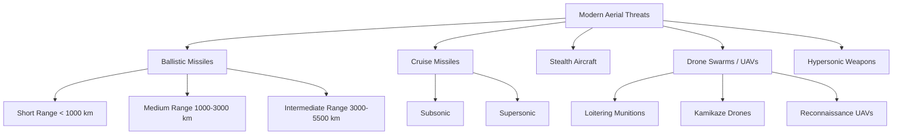
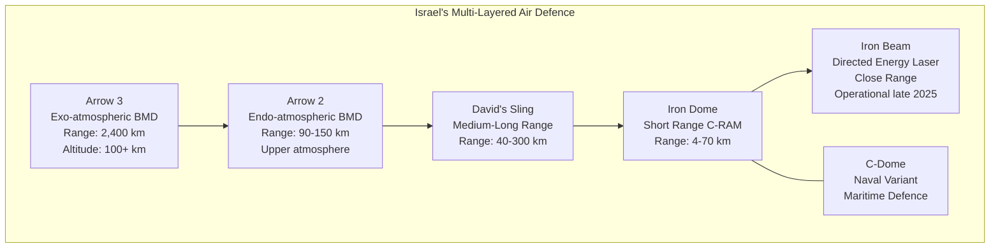
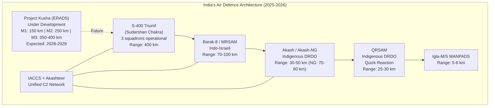
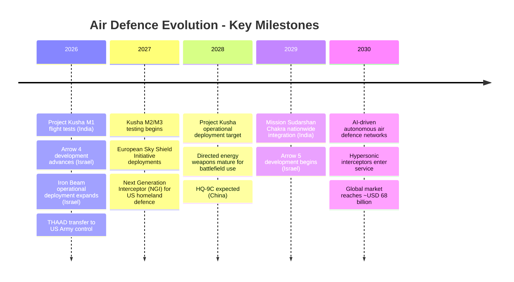

# Global Air Defence Systems: Who Defends the Skies, and How Well?

## Summary

Air defence has moved from a supporting role to the defining capability in modern warfare. The global air defence systems market, valued at approximately USD 49.6 billion in 2024, is projected to reach USD 67.9 billion by 2030 at a CAGR of 5.4%, per Grand View Research and The Research Insights. This growth is being accelerated by the proliferation of drones, cruise missiles, and hypersonic weapons that have fundamentally altered how nations think about protecting their airspace.

This analysis compares the major air defence systems operated by the United States, Russia, Israel, China, India, and Europe across six dimensions: technical capability, layered architecture, combat performance, export influence, cost-effectiveness, and strategic positioning. The central finding is that no single system "wins" the comparison, because modern air defence is a system-of-systems problem. Russia's S-400 offers the broadest engagement envelope at the lowest cost per battery (approximately USD 500 million), but Israel's four-tier architecture (Iron Dome, David's Sling, Arrow 2/3, and Iron Beam) has demonstrated the most rigorous combat validation, intercepting approximately 86-90% of over 550 Iranian ballistic missiles during the June 2025 Twelve-Day War. India's experience during Operation Sindoor in May 2025, where its integrated grid of S-400, Barak-8, and Akash systems neutralized hundreds of Pakistani drones, marks a watershed in multi-origin system interoperability. Meanwhile, China's HQ-9B is rapidly gaining export traction with deliveries to Pakistan, Egypt, Iran, and Azerbaijan in 2025 alone, positioning Beijing as a credible alternative to both Russian and Western suppliers.

The key strategic takeaway: the era of single-system procurement is over. Nations that invest in layered, integrated architectures with diverse interceptor types and AI-driven command and control will hold the advantage. India, with Project Kusha (expected deployment 2028-2029) and the Mission Sudarshan Chakra framework, is positioning itself to join this elite tier.

---

## Context & Background

### The Evolving Threat Landscape

The aerial threat environment has transformed dramatically in the past five years. Three developments define the current era.

First, drone warfare has matured from a niche capability to a dominant battlefield factor. The Russia-Ukraine conflict demonstrated that USD 500 commercial drones can overwhelm systems costing millions per interceptor, creating an asymmetry that favours attackers at ratios of 10:1 to 100:1 in cost terms. Operation Sindoor in May 2025, where Pakistan launched hundreds of swarm drones and loitering munitions against Indian targets, reinforced this lesson on the subcontinent.

Second, hypersonic missiles have entered operational service. Iran's deployment of multi-warhead ballistic missiles (including the "Haj Qassem" type) during the June 2025 Twelve-Day War against Israel tested even the world's most advanced layered defence to its limits. Israel reported running low on Arrow interceptors during the 12-day campaign, per The Wall Street Journal.

Third, the distinction between "air defence" and "missile defence" has blurred. Modern systems like the S-400 and Patriot PAC-3 MSE are expected to handle both aircraft and ballistic missiles, while specialized systems like THAAD address the high-altitude, exo-atmospheric tier.



### Market Dynamics

The air defence market is experiencing its fastest growth in decades. Defence budgets worldwide are being redirected toward integrated air and missile defence, with Europe leading the acceleration.

```echarts
{
  "title": { "text": "Global Air Defence Systems Market (USD Billion)", "left": "center", "textStyle": { "fontSize": 14 } },
  "tooltip": { "trigger": "axis" },
  "xAxis": {
    "type": "category",
    "data": ["2022", "2023", "2024", "2025E", "2026E", "2028E", "2030E"]
  },
  "yAxis": { "type": "value", "name": "USD Billion" },
  "series": [{
    "name": "Market Size",
    "type": "bar",
    "data": [36.0, 46.9, 49.6, 52.3, 55.1, 61.2, 67.9],
    "itemStyle": { "color": "#2563eb" },
    "label": { "show": true, "position": "top", "formatter": "${c}B" }
  }]
}
```

The European Commission's Readiness 2030 programme intends to mobilize up to EUR 800 billion for defence improvements, with a significant portion directed at air and missile defence. Germany alone committed EUR 4 billion to procure the Israeli Arrow-3 system, with deliveries starting in December 2025, and has signaled intent to acquire the Arrow 4 as well. The Asia-Pacific region is the fastest-growing market segment, growing at over 6% CAGR, driven by India-Pakistan tensions, China's military expansion, and North Korean missile threats.

---

## Major Systems: Technical Comparison

The table below captures the headline specifications of the world's ten most significant air defence systems. These figures come from manufacturer publications, defence ministry disclosures, and defence analyst assessments. Where ranges differ across sources, the most commonly cited figures are used.

:::table {width:100%}
| System [w=160] | Country [w=90] | Max Range (km) [w=100] | Max Altitude (km) [w=100] | Interceptor Speed [w=100] | Primary Role [w=200] | Combat Proven [w=100] |
|:---------------|:---------------|:----------------------|:-------------------------|:------------------------|:--------------------|:---------------------|
| S-400 Triumf | :fas-flag: Russia | 400 (40N6E) | 30-56 | Mach 14 | Multi-role: aircraft, cruise/ballistic missiles, UAVs | :fas-circle-check: Yes (2025) |
|> **Details** - Four missile types (40/120/250/400 km ranges). 91N6E radar detects at 600 km. Engages 36 targets simultaneously. Deploys in 5 minutes. Battery cost approximately USD 500M. Exported to India (5 regiments), China (6 batteries), Turkey (4 batteries). |
| Patriot PAC-3 MSE | :fas-flag: USA | 160-180 | 24 | Mach 5 | Theatre air defence, terminal ballistic missile defence | :fas-circle-check: Yes (Ukraine, Middle East) |
|> **Details** - Hit-to-kill kinetic warhead for BMD. Active radar homing. Proven against Russian Kinzhal hypersonic missiles in Ukraine. PAC-3 MSE interceptor cost approximately USD 5.17M. Exported to 18+ countries. Battery cost USD 1-2 billion. |
| THAAD | :fas-flag: USA | 200 | 150 | Mach 8 | Terminal-phase ballistic missile defence (exo/endo-atmospheric) | :fas-circle-check: Yes (2022-2026) |
|> **Details** - Hit-to-kill kinetic interceptor. AN/TPY-2 radar detects at 1,000 km. 48 interceptors per battery (8 per launcher, 6 launchers). Battery cost USD 2.73 billion (per AEI 2025 estimate). Interceptor cost USD 12.9-20.6M. 8 US batteries operational. First combat intercept: January 2022 (Abu Dhabi). Radar reportedly destroyed in Jordan during 2026 Iran conflict. |
| Iron Dome | :fas-flag: Israel | 70 | 10 | Mach 2.2 | Short-range C-RAM, counter-rocket/artillery/drone | :fas-circle-check: Yes (5,000+ intercepts) |
|> **Details** - Tamir interceptor cost approximately USD 50,000. Over 90% success rate across multiple conflicts since 2011. 10 batteries, 20 interceptors each. Selective engagement algorithm saves 40-60% ammunition by ignoring non-threatening trajectories. Each battery protects approximately 150 sq km. |
| David's Sling | :fas-flag: Israel/USA | 300 | 15+ | Supersonic | Medium-to-long range: cruise missiles, tactical BMs, aircraft | :fas-circle-check: Yes (2023-2025) |
|> **Details** - Stunner interceptor uses AESA radar + hit-to-kill. No warhead; destroys via kinetic impact. Interceptor cost approximately USD 1M (75% less than PAC-3 MSE). Can defeat 92% of global SRBM inventory per RTX. Shot down first ballistic missile in June 2025. |
| Arrow 2/3 | :fas-flag: Israel/USA | 2,400 (Arrow 3) | 100+ (exo-atmospheric) | Hypersonic | Long-range ballistic missile defence | :fas-circle-check: Yes (2024-2025) |
|> **Details** - Arrow 3 intercepts in space (exo-atmospheric). Hit-to-kill. Green Pine AESA radar. Arrow 3 production rate tripled post-2025 war. Exported to Germany (EUR 4B deal, delivered December 2025). Arrow 4 under development for hypersonic threats. |
| HQ-9B | :fas-flag: China | 260 | 45-50 | Mach 4.2 | Long-range: aircraft, cruise missiles, limited BMD | :fas-triangle-exclamation: Limited (2025) |
|> **Details** - Dual-mode terminal guidance (active radar + passive IR seeker). AESA radar tracks 100 targets, engages 50+. New variant doubles launcher capacity to 8 missiles. Export designation FD-2000B. Exported to Pakistan, Turkmenistan, Uzbekistan, Egypt, Azerbaijan, and reportedly Morocco. |
| Aster 30 SAMP/T | :fas-flag: France/Italy | 120 (Block 1NT) | 20 | Mach 4.5 | Area defence: aircraft, cruise missiles, limited BMD | :fas-circle-check: Yes (Ukraine) |
|> **Details** - Eurosam joint development. 360-degree coverage capability. Block 1NT upgrade (2025) enhances BMD capability. Arabel radar for tracking. European strategic autonomy option vs. Patriot. Battery cost approximately EUR 200M. |
| NASAMS | :fas-flag: Norway/USA | 25-50 (AMRAAM-ER) | 15+ | Supersonic | Medium-range: aircraft, cruise missiles, UAVs | :fas-circle-check: Yes (Ukraine) |
|> **Details** - 12+ country deployments. Fires multiple missile types (AMRAAM, AMRAAM-ER, AIM-9X). 94% hit rate with 900+ intercepts in Ukraine. Battery cost USD 91-428M depending on configuration. AMRAAM interceptor cost USD 1.09-1.2M. De facto NATO medium-range standard. |
| IRIS-T SL | :fas-flag: Germany | 40 | 20 | Supersonic | Short-to-medium range: cruise missiles, aircraft, UAVs | :fas-circle-check: Yes (Ukraine) |
|> **Details** - 99% interception rate in Ukraine (240+ confirmed kills). Battery cost approximately EUR 200M. Interceptor cost EUR 335,000-420,000. Neutralized 15 cruise missiles in single engagement. Highest documented success rate among deployed systems as of 2025. |
| Akash | :fas-flag: India | 30-50 (Akash-NG: 70-80) | 18 | Mach 2.5 | Short-to-medium range: aircraft, UAVs, cruise missiles | :fas-circle-check: Yes (2025) |
|> **Details** - 96% indigenous content. Rajendra phased-array radar. Command guidance with terminal active homing. Successfully intercepted kamikaze drones during Operation Sindoor (May 2025). Export interest from Armenia, Brazil, Vietnam, UAE. |
:::

### Key Technical Distinctions

A critical point that is often missed in popular comparisons: these systems are not interchangeable. Comparing the S-400 to THAAD is like comparing a Swiss army knife to a surgical scalpel. The S-400 is a multi-role system designed to engage everything from low-flying drones to high-altitude aircraft, with limited ballistic missile capability (ceiling of approximately 30 km against BMs, or 15 km with the 40N6E against ballistic targets). THAAD, by contrast, is a dedicated ballistic missile defence system that operates at altitudes up to 150 km, nearly ten times the S-400's ballistic engagement ceiling, and uses hit-to-kill kinetic warheads that physically destroy the missile warhead rather than relying on fragmentation.

:::columns-2
:::section {border}
**Fragmentation Warheads (S-400, most SAMs)**

Fragmentation warheads detonate near the target, spraying shrapnel. Effective against aircraft and cruise missiles (soft targets), but less effective against ballistic missile re-entry vehicles, which are hardened to survive atmospheric re-entry. A "successful" fragmentation intercept can still leave large debris reaching the ground, causing casualties in urban environments.
:::
+++
:::section {border}
**Hit-to-Kill Kinetic Warheads (THAAD, PAC-3, Arrow 3, David's Sling)**

The interceptor physically strikes the target, specifically the warhead section, at extreme closing speeds. This guarantees destruction of the payload (including chemical, biological, or nuclear material) and minimizes debris size. The energy released from kinetic impact is vastly greater than fragmentation. Without hit-to-kill capability, a system is fundamentally limited in ballistic missile defence.
:::
:::

---

## Layered Air Defence Architecture by Country

The decisive advantage in modern air defence belongs not to any single system but to nations that have built layered, integrated architectures where multiple systems cover overlapping threat envelopes. Below is how the major military powers structure their defences.

### Israel: The Gold Standard

Israel operates the world's most comprehensive and combat-tested layered air defence, with six distinct tiers deployed operationally.



During the June 2025 Twelve-Day War, Iran launched approximately 550 medium-range ballistic missiles at Israel. The Israeli Defence Forces reported an overall intercept rate of approximately 86-90%, with Arrow systems handling long-range ballistic threats, David's Sling engaging medium-tier missiles, and even Iron Dome's Tamir interceptors successfully engaging ballistic missile warheads at 5-7 km altitude, well outside their nominal design envelope. The "shoot-look-shoot" doctrine, where a failed upper-tier intercept triggers a lower-tier attempt, proved its value by maximizing successful kills while conserving expensive upper-tier interceptors. However, approximately 31 missiles struck locations of strategic or civilian importance, and another 25-40 landed in open fields, per analyst assessments from Missile Matters.

### United States: Theatre and Homeland Defence

The US operates a global missile defence architecture spanning land, sea, and space-based sensors.

:::table
| Layer [w=200] | System [w=200] | Role [w=350] |
|:-------------|:---------------|:-------------|
| Upper Tier (Exo/Endo) | THAAD (8 batteries) | Terminal-phase BMD against SRBMs to IRBMs |
|> Deployed in US (5), Guam (1), South Korea (1), plus rotational Middle East deployments. AN/TPY-2 radar provides 1,000 km detection. |
| Upper Tier (Sea-based) | Aegis BMD (SM-3) | Sea-based midcourse and terminal BMD |
|> SM-3 Block IIA interceptors on Navy destroyers. Aegis Ashore installations in Romania and Poland. |
| Lower Tier | Patriot PAC-3 MSE | Theatre air and missile defence |
|> 18+ export customers. Proven against Kinzhal in Ukraine. Core of allied integrated air defence. |
| Sea-based Multi-role | Aegis (SM-6) | Anti-air, anti-cruise missile, limited BMD, surface strike |
|> Multi-mission capability. Deployed across the Navy fleet. |
| Homeland | Ground-Based Interceptor (GBI) | ICBM defence (midcourse intercept) |
|> 44 interceptors at Fort Greely (AK) and Vandenberg (CA). Under Next Generation Interceptor upgrade. |
:::

The US system's strength is global coverage through forward-deployed assets and naval mobility. Its weakness, exposed during the 2025-2026 Iran conflict, is interceptor inventory depth. Approximately 150 THAAD interceptors were fired during Iran's barrages against Israel, representing roughly 25% of all THAAD interceptors ever funded by the US military, per reports from The War Zone and The Wall Street Journal. A THAAD radar was also reportedly destroyed at Muwaffaq Salti Air Base in Jordan during the March 2026 Iran war.

### India: Rapid Integration Under Fire

India's air defence architecture is a hybrid of Russian, Israeli, and indigenous systems, unified by two command-and-control frameworks: the IAF's Integrated Air Command and Control System (IACCS) and the Indian Army's Akashteer system. Operation Sindoor in May 2025 was the first combat validation of this integrated grid.



The integration achievement during Operation Sindoor was unprecedented: systems from three different countries of origin (Russia, Israel, India), connected through an Indian-built command network, successfully operated as a cohesive unit to neutralize over 500 drones and missiles. The Akash system earned particular praise from India's DGMO for "stellar" performance against kamikaze drones. India now operates three S-400 squadrons, with two more expected from Russia by 2026.

Project Kusha, India's indigenous long-range air defence programme, represents the next leap. Cleared by the Cabinet Committee on Security in May 2022 at an estimated cost of INR 21,700 crore (approximately USD 2.6 billion) for five IAF squadrons, it is designed to rival the S-400 with three interceptor tiers (M1: 150 km, M2: 250 km, M3: 350-400 km). The DRDO chief announced in June 2025 that Kusha is "equivalent to Russia's S-500 and surpasses the S-400 in capabilities." Initial development trials were completed in March 2026, with flight testing of the M1 interceptor imminent. Bharat Electronics Limited anticipates orders worth up to INR 40,000 crore (USD 4.7 billion) from the programme. Project Kusha is a cornerstone of Mission Sudarshan Chakra, India's planned nationwide, AI-enabled, multi-layered air defence network announced by Prime Minister Modi on August 15, 2025.

### China: Depth Through Domestic Production

China operates a dense, multi-layered architecture built primarily on indigenous systems supplemented by Russian imports.

:::table {width:100%}
| Layer [w=180] | System [w=180] | Specifications [w=350] |
|:-------------|:---------------|:----------------------|
| Long Range | S-400 (imported) | 6 batteries acquired from Russia since 2018 |
| Long Range | HQ-9B (indigenous) | Range: 260 km, altitude 45-50 km. Deployed in South China Sea, Beijing, Tibet, Xinjiang |
|> New variant doubles launcher capacity to 8 missiles. AESA radar tracks 100+ targets. Dual-mode seeker (radar + IR). |
| Medium Range | HQ-22 (indigenous) | Range: 170 km, altitude: 27 km. Export variant FK-3 sold to Serbia |
| Short Range | HQ-16 | Medium-range fill between HQ-9 and SHORAD |
| SHORAD | HQ-7, HQ-17 | Point defence for military formations |
:::

China's strategy is depth through scale. By deploying the HQ-9B across sensitive regions (South China Sea artificial islands, Taiwan Strait approaches, border areas), China creates overlapping coverage zones that would be extremely costly for an adversary to suppress. The HQ-9B's growing export success, with deliveries to Pakistan, Egypt, Azerbaijan, Iran, Turkmenistan, and Uzbekistan in 2024-2025, positions China as a credible third option in the global air defence market alongside Russia and the West.

---

## Combat Performance: Real-World Data

Theory and specifications matter less than what happens when missiles fly. The past three years have produced more real-world air defence data than the previous three decades combined, thanks to conflicts in Ukraine, the Middle East, and South Asia.

```echarts
{
  "title": { "text": "Combat Interception Rates by System (2022-2025)", "left": "center", "textStyle": { "fontSize": 14 } },
  "tooltip": { "trigger": "axis", "axisPointer": { "type": "shadow" } },
  "xAxis": {
    "type": "category",
    "data": ["IRIS-T SL\n(Ukraine)", "Iron Dome\n(Israel)", "NASAMS\n(Ukraine)", "Patriot\n(Ukraine/ME)", "Arrow 2/3\n(Israel)", "Israel Layered\n(Jun 2025)"],
    "axisLabel": { "interval": 0, "fontSize": 11 }
  },
  "yAxis": { "type": "value", "name": "%", "max": 100 },
  "series": [{
    "name": "Intercept Rate",
    "type": "bar",
    "data": [99, 90, 94, 85, 85, 88],
    "itemStyle": { "color": "#16a34a" },
    "label": { "show": true, "position": "top", "formatter": "{c}%" }
  }]
}
```

**Key combat lessons from 2022-2025:**

Germany's IRIS-T SL has emerged as the surprise performer with a 99% combat interception rate in Ukraine, achieving 240+ confirmed kills including neutralizing 15 cruise missiles in a single engagement. At EUR 335,000-420,000 per interceptor, it offers the best cost-effectiveness among medium-range systems, per Norsk Luftvern analysis.

The Patriot PAC-3 MSE demonstrated it can engage hypersonic targets when it successfully intercepted Russian Kinzhal missiles in Ukraine, a target type it was not originally designed to defeat. However, Patriot's high interceptor cost (USD 5.17M per PAC-3 MSE) makes sustained operations against high-volume attacks economically unsustainable.

Israel's layered defence during the Twelve-Day War (June 2025) showed that shoot-look-shoot doctrine across multiple tiers maximizes overall effectiveness. David's Sling intercepted ballistic missiles beyond its nominal design envelope, and even Iron Dome's Tamir interceptors successfully engaged medium-range ballistic missile warheads, demonstrating capability that exceeded stated specifications.

India's Operation Sindoor (May 2025) validated multi-origin system integration. The Akash (Indian), Barak-8 (Indo-Israeli), and S-400 (Russian) systems, connected via the IACCS and Akashteer networks, operated seamlessly to counter Pakistan's drone and missile barrage. This is the first known combat demonstration of three-country-origin air defence interoperability.

> :fas-triangle-exclamation: **Data Caveat:** Combat interception rates are reported by the operating nation and are inherently subject to confirmation bias. Independent verification is limited, especially for recent conflicts. The figures above should be treated as Tier 2 (Estimated) confidence, with the exception of IRIS-T SL and NASAMS data from Ukraine, which benefit from broader third-party analysis.

---

## Export Market & Geopolitical Influence

Air defence exports are as much about strategic influence as revenue. Selling a nation its air defence system creates deep, multi-decade dependency through training, maintenance, ammunition supply, and software updates. The export landscape is dominated by three ecosystems: Russian, American, and an emerging Chinese challenger.

```echarts {height:500}
{
  "title": { "text": "Air Defence System Export Ecosystem (Estimated Operators)", "left": "center", "textStyle": { "fontSize": 14 } },
  "tooltip": { "trigger": "item" },
  "series": [{
    "name": "Operators",
    "type": "pie",
    "radius": ["40%", "70%"],
    "data": [
      { "value": 18, "name": "Patriot (US)", "itemStyle": { "color": "#2563eb" } },
      { "value": 12, "name": "NASAMS (US/Norway)", "itemStyle": { "color": "#60a5fa" } },
      { "value": 8, "name": "S-400 (Russia)", "itemStyle": { "color": "#dc2626" } },
      { "value": 10, "name": "Iron Dome / David's Sling (Israel)", "itemStyle": { "color": "#f59e0b" } },
      { "value": 7, "name": "HQ-9/FD-2000 (China)", "itemStyle": { "color": "#eab308" } },
      { "value": 6, "name": "SAMP/T (France/Italy)", "itemStyle": { "color": "#8b5cf6" } },
      { "value": 4, "name": "IRIS-T SL (Germany)", "itemStyle": { "color": "#14b8a6" } }
    ],
    "label": { "formatter": "{b}: {c}" }
  }]
}
```

:::columns-2
:::section {border}
**Russian Ecosystem (S-400/S-300)**

Russia's S-400 has been exported to India (5 regiments, USD 5.25B deal), China (6 batteries), Turkey (4 batteries, triggering US sanctions and F-35 programme removal), and Belarus. The system offers strong capability at a competitive price but carries sanction risk from the US under CAATSA (Countering America's Adversaries Through Sanctions Act). Russia's ability to fulfil new orders has been constrained by the Ukraine war and production capacity limitations.
:::
+++
:::section {border}
**American Ecosystem (Patriot/THAAD)**

The Patriot is the most widely exported high-end system, with 18+ operator nations. THAAD exports are more limited due to cost (USD 2.73B per battery) and strategic sensitivity: the UAE was the first foreign buyer, Saudi Arabia signed a major deal, and Qatar agreed to a USD 42B package in May 2025 that includes THAAD. US systems come with deep integration into American intelligence and early warning networks, which is both an advantage and a dependency.
:::
:::
:::columns-2
:::section {border}
**Chinese Ecosystem (HQ-9/FK-3):** China's air defence exports have accelerated sharply in 2024-2025. The HQ-9B has been delivered to Pakistan (operational since 2021, first combat use in May 2025), Egypt (mid-2025, deployed in the Sinai), Azerbaijan (November 2025), and reportedly Iran (post-Twelve-Day War, paid for in oil). The HQ-22's export variant FK-3 was sold to Serbia (delivered 2022), marking the first Chinese medium-to-long range air defence export to Europe. China offers competitive pricing, fewer political conditions, and no sanctions risk, making it attractive to nations that cannot or will not buy Western or Russian systems.
:::
+++
:::section {border}
**Israeli Ecosystem:** Israel's export strength is in the upper tier. The Arrow 3 deal with Germany (EUR 4 billion, delivered December 2025) was Israel's largest-ever military export. Germany has also signaled intent to procure Arrow 4. David's Sling and Iron Dome have been exported to limited partners (the US purchased two Iron Dome systems, Singapore and Romania have agreements).
:::
:::
---

## Cost & Affordability Analysis

The economics of air defence have become a strategic concern in their own right. The fundamental problem is the cost asymmetry between attack and defence: a USD 500 drone can force the expenditure of a USD 50,000 Iron Dome interceptor, or worse, a USD 5 million Patriot missile.

```echarts
{
  "title": { "text": "Interceptor Cost Comparison (USD, Log Scale)", "left": "center", "textStyle": { "fontSize": 14 } },
  "tooltip": { "trigger": "axis" },
  "xAxis": {
    "type": "category",
    "data": ["Iron Dome\nTamir", "IRIS-T SL", "S-400\n(avg)", "NASAMS\nAMRAAM", "David's Sling\nStunner", "Patriot\nPAC-3 MSE", "THAAD"],
    "axisLabel": { "interval": 0, "fontSize": 10 }
  },
  "yAxis": { "type": "log", "name": "USD (thousands)", "min": 10 },
  "series": [{
    "name": "Cost per Interceptor (USD thousands)",
    "type": "bar",
    "data": [50, 380, 650, 1100, 1000, 5170, 16750],
    "itemStyle": { "color": "#f97316" },
    "label": { "show": true, "position": "top", "formatter": "${c}K" }
  }]
}
```

:::table {width:100%}
| System [w=160] | Battery Cost [w=160] | Interceptor Cost [w=140] | Cost-Effectiveness Rating [w=200] |
|:---------------|:--------------------|:------------------------|:---------------------------------|
| Iron Dome | ~USD 50M per battery | ~USD 50K (Tamir) | :fas-circle-check: Best for C-RAM. Selective engagement saves 40-60% ammo |
| IRIS-T SL | ~EUR 200M | EUR 335-420K | :fas-circle-check: Best combat cost-effectiveness (99% rate, low cost) |
| NASAMS | USD 91-428M | USD 1.09-1.2M (AMRAAM) | :fas-circle-check: Good. Flexible multi-missile capability |
| S-400 | ~USD 500M | USD 0.3-2M (varies by type) | :fas-circle-check: Best value for long-range multi-role |
| David's Sling | Classified | ~USD 1M (Stunner) | :fas-circle-check: 75% cheaper than PAC-3 MSE for medium tier |
| Patriot PAC-3 | USD 1-2B | USD 5.17M (PAC-3 MSE) | :fas-triangle-exclamation: High cost, but justified for BMD |
| THAAD | USD 2.73B | USD 12.9-20.6M | :fas-triangle-exclamation: Premium cost for premium BMD capability |
| Arrow 3 | ~USD 3B+ (program) | Classified (very high) | :fas-circle-xmark: Extremely expensive, but irreplaceable for exo-BMD |
:::

The path to economic sustainability lies in two directions. First, layered architectures that match interceptor cost to threat value: use IRIS-T SL or Iron Dome against drones and rockets, reserve Patriot for cruise missiles and aircraft, and deploy THAAD/Arrow only against ballistic missiles. Second, directed-energy weapons offer a potential revolution. Israel's Iron Beam laser system, which became operational in late 2025 with USD 1.2 billion in US funding, costs only a few dollars per "shot" in electricity, compared with tens of thousands for kinetic interceptors. If directed-energy technology matures, it could fundamentally solve the cost asymmetry for short-range threats.

---

## India's Strategic Air Defence Posture

India's air defence posture deserves dedicated analysis given the country's unique strategic environment: it faces two nuclear-armed adversaries (Pakistan and China) on two separate fronts, with radically different threat profiles.

### Current Capabilities and Operational Validation

Operation Sindoor demonstrated that India's multi-layered grid works under combat conditions. The system hierarchy as of early 2026 comprises the S-400 Triumf (3 squadrons operational, 2 more expected by 2026) for long-range area denial, the Barak-8/MRSAM (jointly developed with Israel) for medium-range coverage at 70-100 km, the Akash system with 96% indigenous content for short-to-medium range defence at 30-50 km, and DRDO's anti-drone technologies for close-in protection.

The IACCS (built by Bharat Electronics Limited) and Akashteer systems form the nervous system, linking radar stations, missile batteries, and airbases across India through high-speed fibre optics for real-time threat assessment and response. The seamless integration of Russian, Israeli, and Indian systems through this Indian-built command network during Operation Sindoor was, by credible accounts, a global first.

### Project Kusha: The Path to Self-Reliance

Project Kusha is arguably India's most consequential ongoing defence programme. At INR 21,700 crore for five IAF squadrons, it is significantly cheaper than the USD 5.25 billion S-400 deal while offering comparable or superior capabilities, including counter-stealth and counter-hypersonic features.

:::columns-2
:::section {border}
**S-400 (Imported)**

- Proven combat track record
- Available now (3 squadrons operational)
- Supply chain dependent on Russia
- Vulnerable to sanctions pressure
- Limited scope for customization
- Cost: USD 5.25B for 5 regiments
:::
+++
:::section {border}
**Project Kusha (Indigenous)**

- Claimed equivalent to S-500 capability
- Expected deployment: 2028-2029
- Full supply chain sovereignty
- Continuous upgrade potential
- Tailored to India's threat environment
- Cost: INR 21,700 crore (~USD 2.6B) for 5 squadrons
:::
:::

Project Kusha is a central component of Mission Sudarshan Chakra, which envisions an AI-enabled, multi-layered, nationwide air defence network integrating Akash-NG, QRSAM, VSHORAD, Barak-8, the S-400, and future directed-energy systems with space-based surveillance. If delivered on schedule, this would place India among the very few nations with a comprehensive, primarily indigenous, multi-tier air defence architecture.

### Strategic Implications for India

India's air defence strategy reflects its broader doctrine of strategic autonomy through multi-alignment. By operating Russian (S-400), Israeli (Barak-8), and indigenous (Akash, Kusha) systems within a single integrated framework, India avoids single-source dependency while building toward long-term self-reliance. The success of this approach during Operation Sindoor has generated international interest in India's integration methodology and could position India as a future exporter of integrated air defence solutions, complementing existing exports like the BrahMos missile. Countries like Armenia, Brazil, Vietnam, and the UAE have already expressed interest in the Akash system.

---

## Synthesis & Implications

### Five Strategic Takeaways

**1. Layered architecture is non-negotiable.** No single system can address the full threat spectrum. Israel's four-tier defence absorbed 550 ballistic missiles in 12 days; a nation relying on just one system type would have been overwhelmed. The cost of building layers is high (several billion dollars minimum for a credible posture), but the cost of not doing so is existential.

**2. Combat data has reshuffled the rankings.** Before 2022, air defence comparisons were largely theoretical. Now, IRIS-T SL's 99% combat success rate, Patriot's proven anti-hypersonic capability, and Iron Dome's sustained high-volume performance provide hard data that paper specifications never could. Systems without combat validation (most notably the HQ-9B and S-500) face a credibility gap, regardless of stated specifications.

**3. The interceptor inventory crisis is real.** Israel ran low on Arrow interceptors during a 12-day campaign. The US expended 25% of all THAAD interceptors ever funded during the same period. These are not sustainable consumption rates for anything beyond short-duration conflicts. Production scaling and directed-energy alternatives are urgent priorities.

**4. China is a rising force in air defence exports.** The HQ-9B's rapid expansion into Pakistan, Egypt, Iran, Azerbaijan, and potentially others in 2024-2025 marks China's emergence as a credible third option. For nations under Western sanctions or unwilling to accept Russian dependency, Chinese systems offer a competitive alternative with fewer political strings.

**5. India is at an inflection point.** The success of Operation Sindoor validates India's multi-origin integration approach. Project Kusha and Mission Sudarshan Chakra, if executed on schedule, will transform India from a major importer of air defence technology to a self-reliant producer and potential exporter. The window for this transition is 2026-2030.

### Future Outlook: 2026-2030



---

## Recommendations

**1. For nations building air defence from scratch:** Begin with a medium-range backbone (NASAMS or IRIS-T SL for cost-effectiveness), add long-range area denial (S-400 for cost-conscious buyers; Patriot for NATO-aligned nations), and plan for a dedicated BMD layer (THAAD or Arrow) if facing ballistic missile threats. Budget USD 3-15 billion for a credible layered posture over 5-10 years.

**2. For India specifically:** Accelerate Project Kusha to reduce S-400 dependency before potential supply chain disruptions. Prioritize directed-energy R&D (India's own Iron Beam equivalent) for the drone swarm threat that will only grow. Export the Akash system aggressively to build India's defence-industrial credibility and generate scale economies.

**3. For the global community:** The interceptor cost asymmetry is the central unsolved problem. Directed-energy weapons, AI-driven selective engagement (like Iron Dome's threat-trajectory filtering), and cheaper interceptor designs (like David's Sling's USD 1M Stunner vs. Patriot's USD 5M PAC-3 MSE) are the three most promising paths. Nations that solve the economics of air defence will hold the strategic advantage in the 2030s.

---

## References

All data and claims in this document are sourced from publicly available reports, official sources, and reputable research institutions. Links are provided below for independent verification.

### Government and Official Sources

1. **US Congressional Research Service - THAAD Overview (IF12645)**  
   https://www.congress.gov/crs-product/IF12645
2. **Wikipedia - Terminal High Altitude Area Defense (comprehensive sourced article)**  
   https://en.wikipedia.org/wiki/Terminal_High_Altitude_Area_Defense
3. **Wikipedia - Arrow Missile Family**  
   https://en.wikipedia.org/wiki/Arrow_(missile_family)
4. **Wikipedia - David's Sling**  
   https://en.wikipedia.org/wiki/David%27s_Sling

### Defence Industry and Analyst Sources

5. **Norsk Luftvern - Air Defense Systems: Combat Performance vs. Economic Reality (June 2025)**  
   https://norskluftvern.com/2025/06/25/air-defense-systems-combat-performance-vs-economic-reality/
6. **Norsk Luftvern - Complete Air Defense Systems Comparison Matrix (January 2026)**  
   https://norskluftvern.com/2026/01/03/the-complete-air-defense-systems-comparison-matrix-western-systems-ranked-and-analyzed/
7. **Breaking Defense - Israel Accelerates Arrow Interceptor Acquisition (July 2025)**  
   https://breakingdefense.com/2025/07/israel-moves-to-significantly-accelerate-acquisition-of-more-arrow-interceptors/
8. **Calcalist/Ctech - Israel Upgrades David's Sling (March 2026)**  
   https://www.calcalistech.com/ctechnews/article/byl5e8zk11l
9. **Missile Matters - How Did Israel's Missile Defense Perform in the 12-Day War? (June 2025)**  
   https://missilematters.substack.com/p/how-did-israels-missile-defense-perform

### India-Specific Sources

10. **Swarajya Magazine - Inside India's Air Defence Network During Operation Sindoor (May 2025)**  
    https://swarajyamag.com/defence/inside-indias-air-defence-network-that-stood-tall-during-operation-sindoor
11. **Wikipedia - Project Kusha (continuously updated)**  
    https://en.wikipedia.org/wiki/Project_Kusha
12. **The Defence News - DRDO Completes Initial Development Trials for Project Kusha (March 2026)**  
    https://www.thedefensenews.com/news-details/DRDO-Completes-Initial-Development-Trials-for-Project-Kusha-Long-Range-Air-Defence-System/
13. **Eurasian Times - DRDO Announces Project Kusha Sky Shield Program (June 2025)**  
    https://www.eurasiantimes.com/indias-project-kusha-sky-shield-program/
14. **IDRW - India's Air Defense Triumph: Akash, MR-SAM, S-400 Interoperability (May 2025)**  
    https://idrw.org/indias-air-defense-triumph-akash-mr-sam-and-s-400-showcase-unprecedented-interoperability-in-operation-sindoor/

### China-Specific Sources

15. **Wikipedia - HQ-9 (comprehensive sourced article)**  
    https://en.wikipedia.org/wiki/HQ-9
16. **Army Recognition - China Unveils New HQ-9B Variant (2024)**  
    https://www.armyrecognition.com/news/aerospace-news/2024/china-unveils-new-variant-of-hq-9b-air-defense-system-with-enhanced-capabilities
17. **Defence Mirror - Iran Acquiring Chinese HQ-9B Air Defense System (July 2025)**  
    https://defensemirror.com/news/39832/Iran_Acquiring_Chinese_HQ_9B_Air_Defense_System_Fearing_Another_Israeli__U_S__Strike_

### Market Research

18. **Grand View Research - Air Defense Systems Market Size Report (2024-2030)**  
    https://www.grandviewresearch.com/industry-analysis/air-defense-systems-market-report
19. **The Research Insights / PR Newswire - Air Defense System Market Size (May 2025)**  
    https://www.prnewswire.com/news-releases/air-defense-system-market-size-worth-67-93-billion-by-2030--exclusive-study-by-the-research-insights-302461671.html
20. **Spherical Insights - Top 10 Air Defence Systems Market Analysis (2025)**  
    https://www.sphericalinsights.com/our-insights/top-10-air-defence-systems

*Last verified: March 2026. Some links may require free registration. Data portals are updated periodically and historical snapshots may differ from current page content.*

---

> **Disclaimer:** This analysis is provided for informational purposes only. It does not claim the correctness of all facts and figures presented, but is purely based on data and information gathered from different sources at the time of writing. Readers should independently verify critical data points before making decisions based on this analysis.
