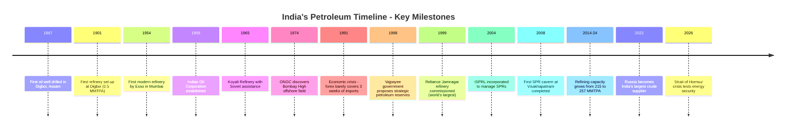
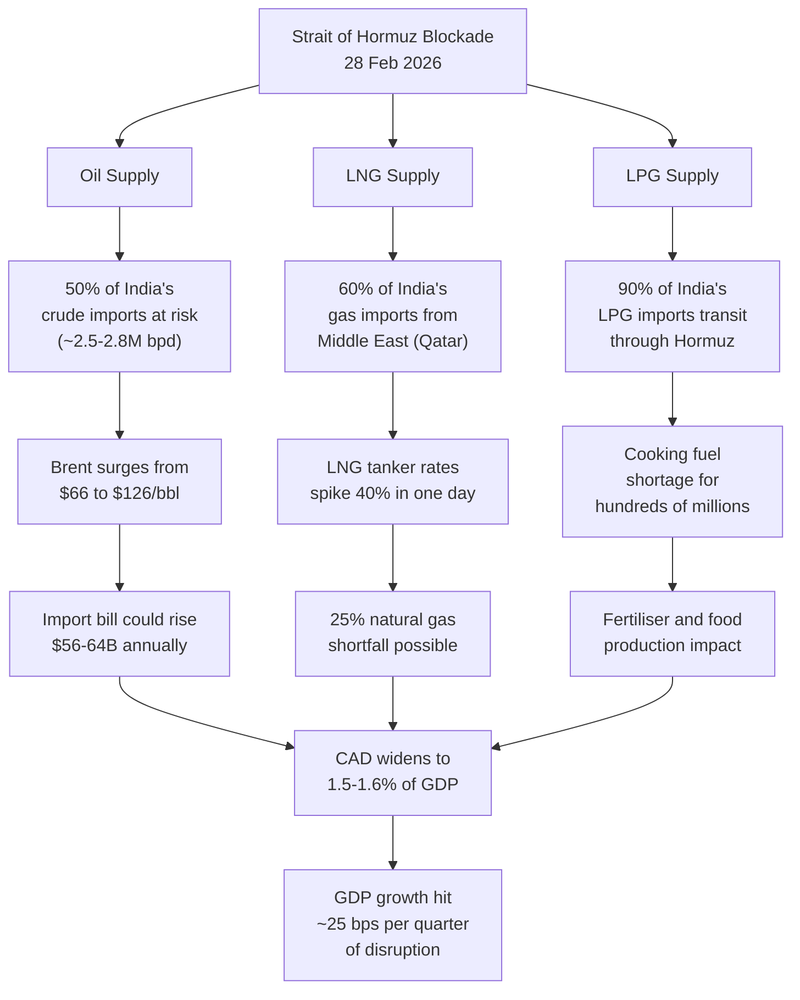
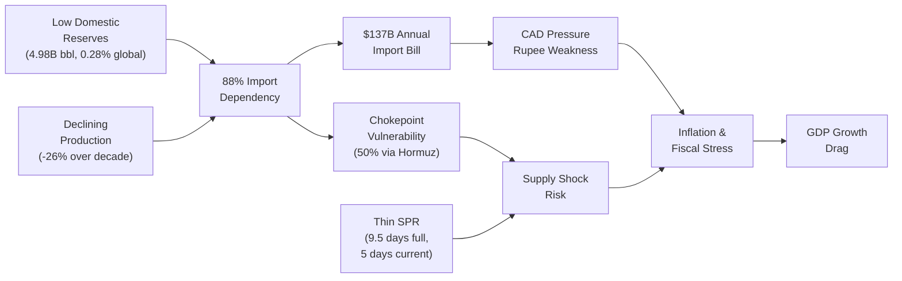

# India and Petroleum: The Complete Strategic Picture

## Summary

India stands at the epicentre of a global energy reckoning. As the world's third-largest oil consumer at `5.6 million` barrels per day (bpd) in 2024, and climbing to a projected `5.74 million` bpd in 2025, India accounts for `25%` of all global oil demand growth, having overtaken China for the first time in 2024, per the U.S. Energy Information Administration (EIA). Yet India produces `less than 1 million` bpd domestically, covering just `12-13%` of its needs, and imports roughly `88%` of its crude oil at a cost of `$137 billion` in `FY 2024-25`, according to data from `India's Petroleum Planning and Analysis Cell (PPAC)`.

`India's Strategic Petroleum Reserves (SPR)` cover a mere `9.5 days` of crude oil needs at full capacity and are currently only `64%` filled, providing just `5 days` of buffer, as revealed by the `Minister of State for Petroleum` in a March 2026 Rajya Sabha reply. By contrast, `Japan` holds `254 days` of cover, `China` holds an estimated `80-90 days` of import cover with `1.3 billion` barrels in storage, and the `United States` holds roughly `100 days` of import cover with `415 million` barrels.

The ongoing 2026 Strait of Hormuz crisis, triggered by the US-Israel-Iran conflict on February 28, 2026, has exposed India's structural vulnerability. Approximately `50%` of India's crude oil imports and nearly `90%` of its LPG imports transit through the strait. `Brent` crude surged from `$66` per barrel to over `$126` at its peak, and the crisis has been described as the largest energy supply disruption since the `1970s`. India's diplomatic manoeuvring, including direct negotiations with Iran for safe passage of Indian LPG tankers, reflects both the severity and the strategic acuity of its response.

>This report provides an exhaustive analysis of every dimension of India's petroleum story: historical evolution, production and consumption dynamics, import dependencies, strategic reserves, refining capacity, bilateral deals, the current crisis, and the road ahead.

---

## Context and Background: India's Petroleum Journey

India's relationship with petroleum stretches back over 150 years. The first oil well was drilled in Digboi, Assam in `1867`, and the first refinery was established at the same site in `1901` by the Assam Oil Company. At independence in 1947, India had just one refinery with a capacity of `0.50 MMTPA` (million metric tonnes per annum), according to the Ministry of Petroleum and Natural Gas.



The journey from a single 0.5 MMTPA refinery to the world's `fourth-largest` refining hub at `258.1 MMTPA` (as of FY25, per `IBEF` data) reflects both India's growth trajectory and its deepening dependency on imported crude. The 1991 economic crisis, when foreign exchange reserves could barely finance three weeks of imports, was a formative shock that seeded the idea of strategic petroleum reserves, formally proposed during the `Atal Bihari Vajpayee` administration in `1998`, per the Wikipedia account of India's SPR history.

---

## India's Oil Consumption: The Engine of Global Demand

India's petroleum consumption has undergone an extraordinary transformation. From 252,000 bpd in 1965 to 5.6 million bpd in 2024, consumption has grown more than 20-fold, per CEIC data. The International Energy Agency projects India will lead global oil demand growth over the next decade and account for nearly half of the incremental global increase, according to the Council on Foreign Relations.

```echarts {height:500}
{
  "title": { "text": "India's Crude Oil Consumption (1990-2026)", "left": "center", "textStyle": { "fontSize": 14 } },
  "tooltip": { "trigger": "axis", "axisPointer": { "type": "shadow" } },
  "xAxis": {
    "type": "category",
    "data": ["1990", "1995", "2000", "2005", "2010", "2015", "2018", "2020", "2021", "2022", "2023", "2024", "2025E", "2026E"],
    "axisLabel": { "rotate": 45 }
  },
  "yAxis": { "type": "value", "name": "Million bpd", "nameLocation": "middle", "nameGap": 45 },
  "series": [{
    "name": "Consumption",
    "type": "bar",
    "data": [1.17, 1.58, 2.26, 2.57, 3.32, 4.08, 4.77, 4.51, 4.77, 5.14, 5.45, 5.60, 5.74, 5.99],
    "itemStyle": { "color": "#c24d00" },
    "label": { "show": true, "position": "top", "fontSize": 9, "formatter": "{c}" }
  }]
}
```

The `COVID-19` pandemic caused a brief dip to `4.51 million` bpd in 2020, but demand rebounded sharply. OPEC projects India's consumption will reach `5.99 million` bpd by 2026, `6.66 million` bpd by 2030, and a staggering `7.2 million bpd` by 2035, per IBEF and India Energy Week data. By 2050, India alone is expected to add 8 million bpd to global oil demand, according to OPEC's World Oil Outlook 2050, as cited by `OilPrice.com`. This trajectory is driven by four structural forces: GDP growth averaging `6-7%` annually, rapid urbanisation, an expanding middle class, and diesel-heavy industrial and freight activity.

:::columns-2
:::section {border}
**What drives demand**

Diesel and gasoil account for nearly half of incremental demand, per India Energy Week data. Jet fuel and kerosene demand are projected to grow fastest in percentage terms at nearly `6%` annually. Gasoline growth will be more modest due to increasing electric vehicle adoption, but India's EV penetration remains low compared to China. Per capita oil consumption stands at just `0.16 gallons` per day (`59 gallons` per year), according to `Worldometer`, which is a fraction of the U.S. figure of roughly `2.5 gallons` per day. This gap represents massive latent demand.
:::
+++
:::section {border}
**Consumption vs production gap**

India produces just `952,481 bpd` of crude oil as of 2024, according to `Worldometer`, ranking `20th` globally. Domestic production peaked at `725,652 bpd` in 2011, per CEIC data, and has been declining steadily since then, falling `26%` over the past decade. Oil wells are ageing and output is dropping. Despite the government opening `one million square kilometres` of previously restricted offshore areas for exploration in 2022 with incentives, domestic crude production fell a further `2.5%` in FY 2024-25, per the `Council on Foreign Relations`.
:::
:::

```echarts {height:500}
{
  "title": { "text": "The Growing Gap: Consumption vs Domestic Production", "left": "center", "textStyle": { "fontSize": 14 } },
  "tooltip": { "trigger": "axis" },
  "legend": { "data": ["Consumption", "Domestic Production"], "bottom": 0 },
  "xAxis": {
    "type": "category",
    "data": ["2000", "2005", "2010", "2015", "2018", "2020", "2022", "2024"]
  },
  "yAxis": { "type": "value", "name": "Million bpd" },
  "series": [
    {
      "name": "Consumption",
      "type": "line",
      "data": [2.26, 2.57, 3.32, 4.08, 4.77, 4.51, 5.14, 5.60],
      "itemStyle": { "color": "#c24d00" },
      "areaStyle": { "color": "rgba(194, 77, 0, 0.15)" },
      "smooth": true
    },
    {
      "name": "Domestic Production",
      "type": "line",
      "data": [0.65, 0.66, 0.72, 0.70, 0.66, 0.63, 0.60, 0.59],
      "itemStyle": { "color": "#2b6cb0" },
      "areaStyle": { "color": "rgba(43, 108, 176, 0.15)" },
      "smooth": true
    }
  ]
}
```

The gap between consumption and production has widened from 1.6 million bpd in 2000 to over 5.0 million bpd in 2024. This structural deficit is the core driver of India's petroleum vulnerability. India's proven oil reserves stand at approximately 4.98 billion barrels as of 2025, ranking 23rd globally and accounting for just 0.28% of the world's total reserves, per Worldometer. At current production rates, India produces about 7% of its proven reserves annually. Without imports, India would exhaust its reserves in roughly 2.4 years.

---

## Import Dependency: Who Feeds India's Oil Appetite

India's crude oil import dependency has climbed relentlessly, reaching `87.7%` in FY 2023-24 and approximately `88.7%` in FY 2024-25, per data from the `Ministry of Petroleum and Natural Gas` and various industry reports. In FY 2024-25, India imported approximately `242.4 million` metric tonnes of crude oil at a cost of `$137 billion`, according to Business Standard.

### The Russia Pivot: A Geopolitical Masterstroke

The most dramatic shift in India's import geography occurred post-2022. Before Russia's invasion of Ukraine, Russian crude accounted for a negligible `1-2%` of India's imports. By FY 2024-25, Russia's share had surged to `35.8%`, making it India's single largest crude supplier, according to DGCI&S data cited by the `Government of India`.

```echarts {height:500}
{
  "title": { "text": "India's Crude Oil Import Sources - The Russia Pivot", "left": "center", "textStyle": { "fontSize": 14 } },
  "tooltip": { "trigger": "axis", "axisPointer": { "type": "shadow" } },
  "legend": { "data": ["Russia", "Iraq", "Saudi Arabia", "UAE", "USA", "Others"], "bottom": 0 },
  "xAxis": {
    "type": "category",
    "data": ["FY 2021 (Pre-War)", "FY 2022-23", "FY 2023-24", "FY 2024-25", "Early 2026"]
  },
  "yAxis": { "type": "value", "name": "% Share", "max": 100 },
  "series": [
    { "name": "Russia", "type": "bar", "stack": "total", "data": [2, 21.6, 35.9, 35.8, 25], "itemStyle": { "color": "#c24d00" } },
    { "name": "Iraq", "type": "bar", "stack": "total", "data": [24, 20, 19, 20.5, 22], "itemStyle": { "color": "#2b6cb0" } },
    { "name": "Saudi Arabia", "type": "bar", "stack": "total", "data": [16, 16, 15, 13, 15], "itemStyle": { "color": "#38a169" } },
    { "name": "UAE", "type": "bar", "stack": "total", "data": [8, 8, 8, 9, 9], "itemStyle": { "color": "#d69e2e" } },
    { "name": "USA", "type": "bar", "stack": "total", "data": [10, 6, 4, 3.5, 7], "itemStyle": { "color": "#805ad5" } },
    { "name": "Others", "type": "bar", "stack": "total", "data": [40, 28.4, 18.1, 18.2, 22], "itemStyle": { "color": "#a0aec0" } }
  ]
}
```

The shift was driven by economics. After Western sanctions, Russian Urals crude was offered at steep discounts. Reuters found that from January to September 2023, the average price for Russian oil delivered to India was `$525.60` per metric ton, compared to `$564.46` for Iraqi oil, representing a discount of approximately `$5` per barrel or `8%`, per the `National Bureau of Asian Research (NBR)`. India's state rating agency ICRA estimated that India saved approximately $13 billion on oil imports across FY 2023 and FY 2024 combined, per NBR data.

However, after US sanctions on Rosneft and Lukoil in November 2025, Indian refiners began diversifying away from Russia. Per `Kpler` data cited by `ThePrint`, Russia's share fell below `25%` for the first time in two years between December 2025 and February 2026, with volumes dropping from `1.7 million` bpd to around `1.0-1.2 million` bpd.

### The Oil Import Bill: A Macroeconomic Weight

India's crude oil import bill has been volatile, closely tracking global prices and the evolving supplier mix.

```echarts {height:500}
{
  "title": { "text": "India's Crude Oil Import Bill (FY 2019-2026E)", "left": "center", "textStyle": { "fontSize": 14 } },
  "tooltip": { "trigger": "axis" },
  "xAxis": {
    "type": "category",
    "data": ["FY19", "FY20", "FY21", "FY22", "FY23", "FY24", "FY25", "FY26E"]
  },
  "yAxis": { "type": "value", "name": "$ Billion", "nameLocation": "middle", "nameGap": 45 },
  "series": [{
    "name": "Import Bill",
    "type": "bar",
    "data": [111.9, 101.4, 62.2, 119.0, 157.5, 132.4, 137.0, 200],
    "itemStyle": {
      "color": function(params) {
        var colors = ["#2b6cb0", "#2b6cb0", "#38a169", "#c24d00", "#e53e3e", "#c24d00", "#c24d00", "#e53e3e"];
        return colors[params.dataIndex];
      }
    },
    "label": { "show": true, "position": "top", "fontSize": 10, "formatter": "${c}B" }
  }]
}
```

The pandemic crashed the bill to a decade-low of `$62.2 billion` in FY 2020-21, per PPAC data cited by `The Quint`. The Ukraine war sent it soaring to a record `$157.5 billion` in FY 2022-23, per `OilPrice.com`. The "**Russian pivot**" then helped bring it down to `$132.4 billion` in FY 2023-24, despite essentially unchanged import volumes. For FY 2025-26, ICRA estimates that if crude averages `$110-115` per barrel amid the Hormuz crisis, the import bill could balloon by an additional `$56-64 billion`, per `Business Standard`.

> :fas-triangle-exclamation: **Critical vulnerability:** Every $10/barrel increase in average crude oil price adds approximately $14-16 billion to India's net oil imports, pushes the current account deficit wider by 30-40 basis points of GDP, and raises WPI inflation by 80-100 basis points, per ICRA estimates cited by Business Standard.

---

## Strategic Petroleum Reserves: India's Thin Buffer

Strategic Petroleum Reserves are a nation's insurance policy against supply shocks. India's SPR programme, conceived after the 1998 Vajpayee proposal and operationalised through the Indian Strategic Petroleum Reserves Limited (ISPRL) incorporated in 2004, has built three underground cavern facilities with a combined capacity of `5.33 million` metric tonnes (approximately `36.92 million` barrels), per Wikipedia and official government data.

### Current SPR Infrastructure

:::table
| Facility [w=200] | Location [w=200] | Capacity (MMT) [w=130] | Capacity (Million Barrels) [w=160] | Status [w=130] |
|:-----------------|:-----------------|:----------------------|:----------------------------------|:--------------|
| Visakhapatnam | Andhra Pradesh | 1.33 | 9.33 | Operational |
|> Coastal location on the east coast with ready access to HPCL Visakhapatnam refinery. Commissioned in 2014-15. |
| Mangaluru | Karnataka | 1.50 | 10.52 | Operational |
|> One cavern (0.75 MMT) leased to Abu Dhabi's ADNOC under the commercialisation agreement signed in July 2021. |
| Padur | Udupi, Karnataka | 2.50 | 17.53 | Operational |
|> Largest of the three Phase I facilities. Located on the west coast near MRPL refinery. |
| **Phase I Total** | | **5.33** | **36.92** | **9.5 days cover** |
|> At full capacity, covers approximately 9.5 days of India's crude oil needs. Currently 64% filled (3.37 MMT), providing only about 5 days of cover. |
| Chandikhol (Phase II) | Odisha | 4.00 | 28.0 | Approved, under development |
|> Approved in July 2021 on PPP model. One of two Phase II facilities. |
| Padur Extension (Phase II) | Karnataka | 2.50 | 17.5 | Construction awarded Oct 2025 |
|> Built by Megha Engineering and Infrastructures Ltd with investment of approximately Rs 5,700 crore ($687 million). |
| **Phase II Total** | | **6.50** | **45.5** | **~12 days additional** |
|> Combined Phase I + Phase II will provide approximately 22 days of crude cover. Still far below the 90-day IEA benchmark. |
| Bikaner (Proposed) | Rajasthan | ~3.0 | ~21 | Proposal stage |
| Rajkot (Proposed) | Gujarat | ~3.0 | ~21 | Proposal stage |
:::

As of March 2026, India's SPRs hold `3.37 MMT` of crude against a total capacity of `5.33 MMT`, just `64%`, as confirmed by `Minister of State` `Suresh Gopi` in the Rajya Sabha. The minister also noted that including Oil Marketing Companies' (OMCs) commercial storage, India's total national capacity for crude oil and petroleum products is `74 days`. However, the SPR-specific buffer of `9.5 days` (at full capacity) is critically thin for the world's third-largest oil consumer.

Former `Indian Oil Corporation Chairman` `SM Vaidya` has called for aggressive expansion, suggesting that raising reserves to `100 million` barrels would provide close to `20 days` of strategic cover, per BusinessToday.

### Global SPR Comparison: India at the Bottom

India's strategic reserves are minuscule compared to other major economies. The comparison below, compiled from Al Jazeera, WION, OilPrice.com, and Wikipedia data from March 2026, reveals the scale of the gap.

```echarts {height:500}
{
  "title": { "text": "Strategic Petroleum Reserves - Global Comparison (Days of Cover)", "left": "center", "textStyle": { "fontSize": 14 } },
  "tooltip": { "trigger": "axis" },
  "grid": { "left": "15%", "right": "5%", "bottom": "5%", "top": "15%" },
  "xAxis": { "type": "value", "name": "Days of Import/Consumption Cover" },
  "yAxis": {
    "type": "category",
    "data": ["India (SPR only)", "India (Total incl. OMCs)", "Indonesia", "South Korea", "USA", "Germany", "France", "China", "Japan"],
    "axisLabel": { "fontSize": 11 }
  },
  "series": [{
    "type": "bar",
    "data": [
      { "value": 9.5, "itemStyle": { "color": "#e53e3e" } },
      { "value": 74, "itemStyle": { "color": "#c24d00" } },
      { "value": 20, "itemStyle": { "color": "#dd6b20" } },
      { "value": 90, "itemStyle": { "color": "#2b6cb0" } },
      { "value": 100, "itemStyle": { "color": "#2b6cb0" } },
      { "value": 90, "itemStyle": { "color": "#2b6cb0" } },
      { "value": 95, "itemStyle": { "color": "#2b6cb0" } },
      { "value": 85, "itemStyle": { "color": "#38a169" } },
      { "value": 254, "itemStyle": { "color": "#38a169" } }
    ],
    "label": { "show": true, "position": "right", "formatter": "{c} days" }
  }]
}
```

```echarts {height:500}
{
  "title": { "text": "Strategic Reserve Capacity (Million Barrels)", "left": "center", "textStyle": { "fontSize": 14 } },
  "tooltip": { "trigger": "axis" },
  "grid": { "left": "12%", "right": "5%", "bottom": "5%", "top": "15%" },
  "xAxis": { "type": "value", "name": "Million Barrels" },
  "yAxis": {
    "type": "category",
    "data": ["India", "South Korea", "Germany", "France", "Japan (Govt)", "USA (SPR)", "China (Total)"]
  },
  "series": [{
    "type": "bar",
    "data": [
      { "value": 37, "itemStyle": { "color": "#e53e3e" } },
      { "value": 93, "itemStyle": { "color": "#d69e2e" } },
      { "value": 110, "itemStyle": { "color": "#2b6cb0" } },
      { "value": 120, "itemStyle": { "color": "#2b6cb0" } },
      { "value": 260, "itemStyle": { "color": "#38a169" } },
      { "value": 415, "itemStyle": { "color": "#38a169" } },
      { "value": 1300, "itemStyle": { "color": "#805ad5" } }
    ],
    "label": { "show": true, "position": "right", "formatter": "{c}M bbl" }
  }]
}
```

The disparity is stark. China holds an estimated 1.3 billion barrels in combined strategic and commercial reserves (enough for approximately 4 months of seaborne imports), per Vortexa data cited by OilPrice.com. Japan holds 470 million barrels across government and private reserves covering 254 days, per Nikkei Asia data cited by Al Jazeera. The United States holds 415 million barrels in its SPR, per the Department of Energy. India's 37 million barrels is roughly 3% of China's total and 9% of the US SPR.

### Historical SPR Capacity Timeline

India's SPR development has proceeded in phases. The cost-saving strategy of filling reserves when prices are low was demonstrated when ISPRL filled tanks during the 2020 price crash, saving approximately `Rs 5,000 crore` at `$19` per barrel, per data from Spherical Insights.

```echarts {height:500}
{
  "title": { "text": "India SPR Capacity Development Timeline", "left": "center", "textStyle": { "fontSize": 14 } },
  "tooltip": { "trigger": "axis" },
  "legend": { "data": ["Operational Capacity", "Planned Additions"], "bottom": 0 },
  "xAxis": {
    "type": "category",
    "data": ["2004", "2008", "2012", "2015", "2018", "2021", "2026", "2028E", "2030E"]
  },
  "yAxis": { "type": "value", "name": "Million Barrels" },
  "series": [
    {
      "name": "Operational Capacity",
      "type": "line",
      "data": [0, 9.3, 20, 27, 37, 37, 37, 37, 37],
      "itemStyle": { "color": "#2b6cb0" },
      "areaStyle": { "color": "rgba(43, 108, 176, 0.2)" },
      "smooth": true
    },
    {
      "name": "Planned Additions",
      "type": "line",
      "data": [0, 0, 0, 0, 0, 0, 0, 67, 87],
      "itemStyle": { "color": "#38a169" },
      "lineStyle": { "type": "dashed" },
      "smooth": true
    }
  ]
}
```

---

## Refining Capacity: India as the World's Refinery

One of India's underappreciated strengths is its refining infrastructure. India is the fourth-largest refiner globally, after the United States, China, and Russia, with a total installed capacity of `258.1 MMTPA` across `23 operational refineries` as of FY25, per IBEF and the Ministry of Petroleum and Natural Gas.

```echarts {height:500}
{
  "title": { "text": "India's Refining Capacity Growth (MMTPA)", "left": "center", "textStyle": { "fontSize": 14 } },
  "tooltip": { "trigger": "axis" },
  "xAxis": {
    "type": "category",
    "data": ["1947", "1970", "1980", "1990", "1998", "2005", "2010", "2014", "2020", "2024", "2025", "2028E"]
  },
  "yAxis": { "type": "value", "name": "MMTPA" },
  "series": [{
    "name": "Capacity",
    "type": "line",
    "data": [0.5, 18, 32, 52, 62, 127, 185, 215, 249, 257, 258, 310],
    "smooth": true,
    "itemStyle": { "color": "#c24d00" },
    "areaStyle": { "color": "rgba(194, 77, 0, 0.15)" },
    "markPoint": {
      "data": [
        { "name": "Jamnagar", "coord": ["1998", 62], "value": "Reliance Jamnagar" },
        { "name": "Target", "coord": ["2028E", 310], "value": "309.5 Target" }
      ]
    }
  }]
}
```

The Jamnagar Refinery operated by Reliance Industries Limited is the world's largest single-location refinery. India's refining capacity is scheduled to expand to `309.5 MMTPA` by 2028, and the government has plans to nearly double capacity to `450-500 MMTPA` by 2030, per IBEF data.

:::columns-2

**India's Refining Strength**

India is not merely a consumer but also the world's seventh-largest exporter of refined petroleum products, per the Ministry of Petroleum and Natural Gas. In FY 2023-24, India exported `30%` of its `gasoline`, `24%` of its `diesel`, `28%` of `naphtha`, and `50%` of `aviation turbine fuel`, per SPF data. This refining surplus means India effectively acts as "the world's refinery," processing crude from diverse sources and supplying fuels to approximately 160 countries.

+++

**Key Refineries by Capacity**

| Refinery | Operator | Capacity (MMTPA) |
|:---------|:---------|:----------------|
| Jamnagar | Reliance | 68.2 |
| Kochi | BPCL | 15.5 |
| Paradip | IOCL | 15.0 |
| Mumbai (BPCL) | BPCL | 12.0 |
| Gujarat | IOCL | 13.7 |
| Vadinar | Nayara | 20.0 |
| Mangalore | MRPL | 15.0 |

:::

>The refining industry is strategically significant because India's capacity to refine cheap Russian crude and export petroleum products to Europe has become a cornerstone of its economic strategy post-2022. India's refining capacity reached 5.17 million bpd in 2024, per SPF data, the fourth highest in the world.

---

## Key Bilateral Energy Deals and Partnerships

India has been building a web of long-term energy partnerships to diversify supply and lock in stable pricing. The major deals of 2024-2026 reflect this strategy.

:::table
| Deal [w=250] | Partners [w=200] | Value / Volume [w=200] | Duration [w=100] | Status [w=120] |
|:-------------|:-----------------|:----------------------|:-----------------|:--------------|
| ADNOC-IOC LNG SPA | ADNOC Gas & Indian Oil Corporation | $7-9 billion, 1.2 MMTPA LNG | 14 years | Signed Feb 2025 |
|> IOC will become ADNOC's largest LNG customer by 2029 with total offtake of 2.2 MMTPA. Deliveries from Das Island facility starting 2026. |
| ADNOC-HPCL LNG SPA | ADNOC Gas & Hindustan Petroleum | $2.5-3 billion, 0.5 MMTPA LNG | 10 years | Signed Jan 2026 |
|> Signed during UAE President's state visit to India. India is now UAE's largest LNG customer overall. |
| ADNOC-GAIL LNG | ADNOC Gas & GAIL India | Up to 0.5 MMTPA LNG | 10 years | Signed Nov 2024 |
|> From Das Island facility, starting 2025. |
| ADNOC Mangalore SPR Lease | ADNOC & ISPRL | 750,000 tonnes cavern capacity | Ongoing | Active |
|> ADNOC leases Cavern-A at Mangaluru. Oil remains in India for emergency access. Strategic-cum-commercial model. |
| Saudi Aramco-BPCL-ONGC Refineries | Saudi Aramco & Indian consortium | Two new 9 MMTPA refineries | Multi-decade | Under discussion |
|> One in Andhra Pradesh with BPCL, another in Gujarat with ONGC. Replaces shelved $44 billion Ratnagiri mega-refinery project. |
| India-UAE Trade Target | Government of India & UAE | $200 billion bilateral trade by 2032 | - | Announced Jan 2026 |
|> Energy is the anchor of expanding ties. UAE was India's third-largest trading partner at $100 billion in FY25. |
| India-Russia Crude Trade | Indian refiners & Russian producers | 1.0-1.7 million bpd crude | Ongoing | Active but declining |
|> Russia became India's largest crude supplier from 2023. Volumes declining under US sanctions pressure in early 2026. |
:::

>The total value of ADNOC's LNG contracts with Indian companies alone exceeds $12 billion, making India the UAE's largest LNG market. These deals are strategic hedges against the very kind of supply disruption India is experiencing in March 2026.

---

## The 2026 Strait of Hormuz Crisis: India in the Crosshairs

The current crisis, triggered by US-Israeli strikes on Iran on February 28, 2026 ("Operation Epic Fury") and Iran's retaliatory blockade of the Strait of Hormuz, represents the most severe test of India's energy security in its history.

### What Is at Stake

The Strait of Hormuz normally handles approximately 20.9 million bpd of crude oil, condensate, and petroleum products, representing roughly 20% of global petroleum liquids consumption, per the U.S. EIA. Since the blockade, tanker traffic has dropped from over 150 daily transits to a trickle of 2-13 vessels per day, per American Bazaar data citing S&P Global.



### India's Multi-Channel Exposure

This is not merely an oil-price crisis. HSBC analysts and MUFG Research have emphasised that the current disruption is fundamentally different from past oil shocks because it simultaneously affects crude oil, LNG, and LPG.

:::columns-2

**Critical exposures, per MUFG and CNBC data:**

- 50-53% of India's crude oil imports transit through Hormuz (approximately 2.5-2.8 million bpd as of Feb 2026)
- 60% of India's natural gas imports come from the Middle East, primarily Qatar
- Nearly 90% of India's LPG and NGL imports come from the Middle East
- LPG is cooking fuel for hundreds of millions of Indian households
- 40% of fertiliser imports come directly from the Middle East

+++

**India's response measures:**

- Diplomatic negotiations with Iran - S. Jaishankar secured safe passage for Indian LPG tankers through direct talks
- Two Indian LPG carriers (Shivalik and Nanda Devi) crossed the strait on March 14, 2026 with Iranian permission
- Government monitoring fuel inventories and exploring alternative routes
- Shift towards increased Russian crude imports through non-Hormuz routes
- Total reserves (SPR + commercial) of approximately 50 days provide short-term buffer
- PM Modi addressed Parliament stating the government is "closely monitoring the evolving situation"

:::

### Oil Price Impact

```echarts {height:500}
{
  "title": { "text": "Brent Crude Oil Price Trajectory (2025-2026)", "left": "center", "textStyle": { "fontSize": 14 } },
  "tooltip": { "trigger": "axis" },
  "xAxis": {
    "type": "category",
    "data": ["Jan 25", "Apr 25", "Jul 25", "Oct 25", "Jan 26", "Pre-War Feb 26", "Mar 1", "Mar 8", "Peak", "Mar 25"]
  },
  "yAxis": { "type": "value", "name": "$/barrel", "min": 50 },
  "series": [{
    "name": "Brent Crude",
    "type": "line",
    "data": [75, 70, 74, 72, 78, 66, 85, 100, 126, 100],
    "smooth": true,
    "itemStyle": { "color": "#e53e3e" },
    "areaStyle": { "color": "rgba(229, 62, 62, 0.1)" },
    "markPoint": {
      "data": [
        { "name": "Pre-war", "coord": ["Pre-War Feb 26", 66], "value": "$66" },
        { "name": "Peak", "coord": ["Peak", 126], "value": "$126 Peak" }
      ]
    },
    "markLine": {
      "data": [{ "name": "War begins", "xAxis": "Mar 1" }],
      "lineStyle": { "color": "#e53e3e", "type": "dashed" }
    }
  }]
}
```

Brent crude surged from approximately `$66` per barrel pre-war to over `$126` at its peak, per Wikipedia's account of the 2026 Strait of Hormuz crisis. The Dallas Federal Reserve Bank has modelled that a one-quarter disruption could reduce global real GDP growth by `0.2 percentage` points, extending to `1.3 percentage` points if the disruption persists for three quarters.

---

## India's Proven Oil Reserves: A Historical Perspective

India's proven oil reserves have remained relatively stagnant over the decades, fluctuating between `4-5 billion` barrels since the 2000s, per The Global Economy and Worldometer data. The peak of `8 billion` barrels was recorded in 1991, per The Global Economy.

```echarts {height:500}
{
  "title": { "text": "India's Proven Oil Reserves - Historical (Billion Barrels)", "left": "center", "textStyle": { "fontSize": 14 } },
  "tooltip": { "trigger": "axis" },
  "xAxis": {
    "type": "category",
    "data": ["1981", "1985", "1991", "1995", "2000", "2005", "2010", "2015", "2020", "2023", "2025"]
  },
  "yAxis": { "type": "value", "name": "Billion Barrels", "min": 0, "max": 10 },
  "series": [{
    "name": "Proven Reserves",
    "type": "line",
    "data": [2.58, 4.0, 8.0, 5.8, 4.7, 5.6, 5.7, 4.7, 4.6, 4.9, 4.98],
    "smooth": true,
    "itemStyle": { "color": "#c24d00" },
    "areaStyle": { "color": "rgba(194, 77, 0, 0.15)" },
    "markPoint": {
      "data": [
        { "type": "max", "name": "Peak: 8B (1991)" }
      ]
    }
  }]
}
```

The reserves are split approximately `61%` onshore and `39%` offshore, per the U.S. EIA's February 2025 country brief on India. Major producing basins include `Mumbai Offshore (Bombay High)`, `Krishna Godavari`, `Rajasthan (Barmer)`, and `the northeast (Assam)`. As of January 2025, India held `651.8 MMT` of crude oil reserves and 1,138.6 BCM of natural gas reserves, per IBEF.

### Reserves in Global Context

India's reserves are negligible on the global stage, ranking 23rd and accounting for just `0.28%` of global reserves.

:::table
| Country [w=160] | Proven Reserves (Billion Barrels) [w=200] | Global Share [w=130] | Reserve Life at Current Production [w=200] |
|:---------------|:----------------------------------------|:--------------------|:------------------------------------------|
| Venezuela | 303 | 17.2% | 500+ years (limited production) |
| Saudi Arabia | 267 | 15.1% | 60+ years |
| Canada | 163 | 9.2% | 95+ years |
| Iran | 157 | 8.9% | 90+ years |
| Iraq | 145 | 8.2% | 80+ years |
| Russia | 80 | 4.5% | 20+ years |
| USA | 47 | 2.7% | 10+ years |
| China | 27 | 1.5% | 18 years |
| **India** | **4.98** | **0.28%** | **~2.4 years** |
:::

At current production and consumption levels, India's reserves would last approximately `2.4 years` without imports, according to Worldometer, making import dependency not just a policy choice but a geological inevitability.

---

## Synthesis and Implications

### The Structural Challenge

India's petroleum position is defined by a fundamental mismatch: the world's fastest-growing major oil demand set against negligible domestic reserves, declining production, and thin strategic buffers. This mismatch creates four interconnected risks.



**First**, the macroeconomic transmission is direct and powerful. Oil imports constitute roughly `30%` of India's total imports. A sustained `$10/barrel` increase translates to `$14-16 billion` in additional imports, `30-40` basis points on the current account deficit, and `80-100` basis points on wholesale inflation, per ICRA.

**Second**, the chokepoint risk is concentrated. Approximately `50%` of crude and `90%` of LPG transit through a single `34-km` wide strait, creating a single point of failure for India's energy security that the current crisis has exposed.

**Third**, the strategic reserve gap is severe. India's `9.5 days` of SPR cover (at full capacity) compares to Japan's `254 days`, China's `80-90 days`, and the IEA recommendation of `90 days`. Even adding OMC commercial stocks to reach `74 days`, India falls short.

**Fourth**, the diversification that Russia provided post-2022 is itself under pressure from US sanctions, creating a new supply uncertainty just as the Hormuz route faces disruption.

### What India Has Done Right

Credit is due for several strategic moves. The diversification of crude sources from `27` to over `40` countries over two decades, per the Council on Foreign Relations, has reduced dependence on any single supplier. The refining capacity build-out to `258 MMTPA` has turned India from a refining-deficit nation in 2001 to a global refining hub and net exporter. The diplomatic agility in securing Iranian permission for LPG tanker transit in March 2026 demonstrates that India's traditionally balanced foreign policy yields practical dividends. And the long-term LNG deals with ADNOC (totalling over `$12 billion`) lock in supply certainty.

---

## Recommendations

Based on the data and analysis presented, five strategic priorities emerge.

:::columns-2

**1. Accelerate SPR expansion to 100M barrels**

The current `37 million` barrels is dangerously insufficient. The approved Phase II additions (`6.5 MMT` / `45.5 million` barrels) must be completed urgently, and the proposed Bikaner and Rajkot facilities should be fast-tracked. A target of `100 million` barrels (approximately `20 days` of strategic cover) is the minimum, as SM Vaidya has argued. Cost: approximately `$5-8 billion` at current prices, a fraction of the annual import bill.

+++

**2. Diversify beyond Hormuz-dependent routes**

Russia provides a non-Hormuz crude source, but political risk limits its reliability. India should pursue long-term supply agreements with Atlantic Basin producers (West Africa, Guyana, Brazil, Canada) and expand pipeline connectivity where possible. The BPCL-Petrobras negotiation is a step in the right direction.

:::

**3. Build dedicated LPG strategic reserves.** The current crisis has revealed that LPG is the most acute vulnerability, with `90%` of imports transiting Hormuz. India has no dedicated LPG strategic reserve. Creating even a `30-day` LPG buffer would protect hundreds of millions of households from cooking fuel disruptions.

**4. Sustain refining advantage and expand product exports.** India's position as the "world's refinery" is a strategic asset that generates foreign exchange and provides geopolitical leverage. The planned expansion to `309.5 MMTPA` by 2028 and `450-500 MMTPA` by 2030 should be pursued aggressively, with continued focus on the complexity upgrades (hydrocracking, coking) that allow processing of diverse crude grades.

**5. Accelerate demand-side transition.** While petroleum demand will grow for decades, policies that promote EV adoption, ethanol blending (targeting `20%` by 2025-26), compressed biogas, and public transport can bend the demand curve. Every million bpd of avoided demand is `$15-20 billion` saved on imports annually at current prices.

---

## References

All data and claims in this document are sourced from publicly available reports, official sources, and reputable research institutions. Links are provided below for independent verification.

### Official Government Sources

1. **Ministry of Petroleum and Natural Gas (India) - Refining Capacity**  
   https://mopng.gov.in/en/refining/refining-capacity
2. **Ministry of Petroleum and Natural Gas (India) - History and Evolution**  
   https://mopng.gov.in/en/refining/history-and-evolution
3. **Press Information Bureau (India) - India's Petroleum Industry**  
   https://www.pib.gov.in/PressReleasePage.aspx?PRID=2096817
4. **Press Information Bureau (India) - Government Steps to Strengthen SPR**  
   https://www.pib.gov.in/PressReleasePage.aspx?PRID=2113233
5. **Petroleum Planning and Analysis Cell (PPAC) - Import/Export Data**  
   https://ppac.gov.in/import-export
6. **DGCI&S - Insights into Import of Crude Oil and International Prices**  
   https://www.dgciskol.gov.in/

### International Energy Agencies and Research

7. **U.S. Energy Information Administration (EIA) - India Country Analysis Brief (Feb 2025)**  
   https://www.eia.gov/international/content/analysis/countries_long/India/
8. **U.S. EIA - India to Surpass China as Top Source of Oil Demand Growth**  
   https://www.eia.gov/todayinenergy/detail.php?id=64084
9. **International Energy Agency (IEA) - World Energy Outlook 2025** (referenced via CFR)
10. **Dallas Federal Reserve Bank - What the Closure of the Strait of Hormuz Means for the Global Economy**  
    https://www.dallasfed.org/research/economics/2026/0320

### Think Tanks and Policy Research

11. **Council on Foreign Relations (CFR) - Oil Energy, India-U.S. Relations, and the Russia Conundrum**  
    https://www.cfr.org/articles/oil-energy-india-u-s-relations-and-the-russia-conundrum
12. **National Bureau of Asian Research (NBR) - Oil for India**  
    https://www.nbr.org/publication/oil-for-india/
13. **CSIS - Guns and Oil: Continuity and Change in Russia-India Relations**  
    https://www.csis.org/analysis/guns-and-oil-continuity-and-change-russia-india-relations
14. **Atlantic Council - What a Middle East Oil and LNG Crisis Means for China and East Asia**  
    https://www.atlanticcouncil.org/dispatches/what-a-middle-east-oil-and-lng-crisis-means-for-china-and-east-asia/
15. **SPF International Information Network - Oil Policies of India Between US and Russia**  
    https://www.spf.org/iina/en/articles/takahashi_07.html

### Industry Analysis and Market Data

16. **Worldometer - India Oil Reserves, Production and Consumption Statistics**  
    https://www.worldometers.info/oil/india-oil/
17. **India Brand Equity Foundation (IBEF) - Oil and Gas Industry**  
    https://www.ibef.org/industry/oil-gas-india
18. **OilPrice.com - India Takes the Lead in Oil Demand Growth**  
    https://oilprice.com/Energy/Crude-Oil/India-Takes-the-Lead-in-Oil-Demand-Growth.html
19. **OilPrice.com - China Stockpiles Soften the Blow of Global Oil Shock**  
    https://oilprice.com/Energy/Crude-Oil/China-Stockpiles-Soften-the-Blow-of-the-Global-Oil-Shock.html
20. **Kpler - US-Iran Conflict: Strait of Hormuz Crisis Reshapes Global Oil Markets**  
    https://www.kpler.com/blog/us-iran-conflict-strait-of-hormuz-crisis-reshapes-global-oil-markets
21. **ICRA Research - Indian Oil and Gas Industry June 2025**  
    https://www.icra.in/Rating/DownloadResearchSpecialCommentReport?id=6374
22. **MUFG Research - India Strait of Hormuz Closure: Not Just About Oil Prices for INR**  
    https://www.mufgresearch.com/fx/india-strait-of-hormuz-closure-not-just-about-oil-prices-for-inr-12-march-2026/

### News and Media Sources

23. **ThePrint - Russian Crude Never Left India's Import Mix**  
    https://theprint.in/economy/russian-crude-never-left-indias-import-mix-it-made-up-1-3rd-of-oil-imports-from-2024-to-2026/2874224/
24. **Business Standard - Crude at $115 Could Raise India's Oil Import Bill by $64 Billion**  
    https://www.business-standard.com/economy/news/crude-115-per-barrel-could-raise-india-oil-import-bill-64-bn-126030900720_1.html
25. **BusinessToday - India Should Go Aggressive in Ramping Petroleum Reserve Capacity: SM Vaidya**  
    https://www.businesstoday.in/latest/economy/story/india-should-go-aggressive-in-ramping-petroleum-reserve-capacity-sm-vaidya-520489-2026-03-13
26. **CNBC - India Signs $3 Billion LNG Agreement with UAE**  
    https://www.cnbc.com/2026/01/20/india-signs-3-billion-lng-agreement-uae-vows-double-trade-us-deal-remains-elusive.html
27. **CNBC - Strait of Hormuz Countries Most Impacted**  
    https://www.cnbc.com/2026/03/03/strait-of-hormuz-closure-which-countries-will-be-hit-the-most.html
28. **Al Jazeera - Which Countries Have Strategic Oil Reserves and How Much**  
    https://www.aljazeera.com/news/2026/3/23/which-countries-have-strategic-oil-reserves-and-how-much
29. **WION - Global Strategic Oil Reserves Explained**  
    https://www.wionews.com/photos/global-strategic-oil-reserves-us-china-japan-europe-oil-stockpiles-1773145988370
30. **Business Standard - India's LPG, Oil Shortage: HSBC Explains Why This Energy Shock Is Different**  
    https://www.business-standard.com/markets/news/india-energy-crisis-lpg-shortage-oil-supply-hormuz-iran-war-hsbc-analysis-126032400652_1.html
31. **Wikipedia - 2026 Strait of Hormuz Crisis**  
    https://en.wikipedia.org/wiki/2026_Strait_of_Hormuz_crisis
32. **Wikipedia - Strategic Petroleum Reserve (India)**  
    https://en.wikipedia.org/wiki/Strategic_Petroleum_Reserve_(India)
33. **Wikipedia - Global Strategic Petroleum Reserves**  
    https://en.wikipedia.org/wiki/Global_strategic_petroleum_reserves

*Last verified: March 2026. Some links may require free registration. Data portals are updated periodically and historical snapshots may differ from current page content.*

---

> **Disclaimer:** This analysis is provided for informational purposes only. It does not claim the correctness of all facts and figures presented, but is purely based on data and information gathered from different sources at the time of writing. Readers should independently verify critical data points before making decisions based on this analysis.
