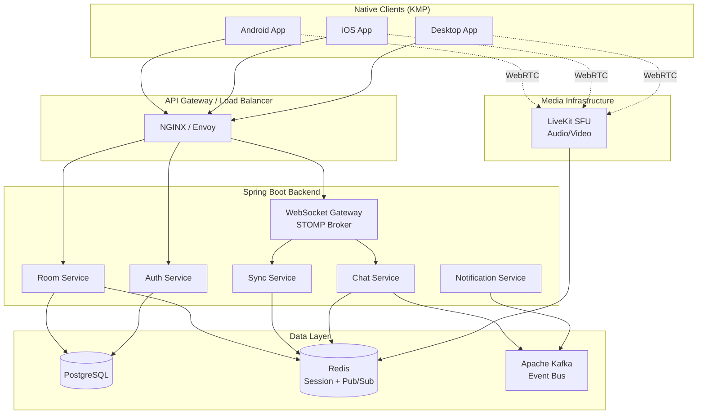
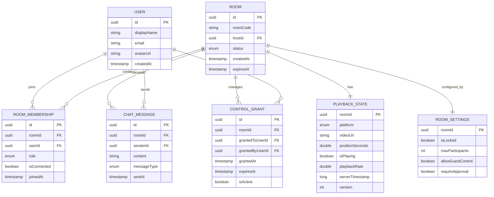
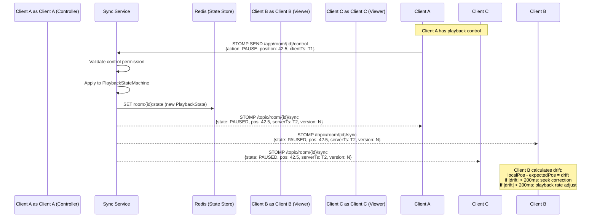
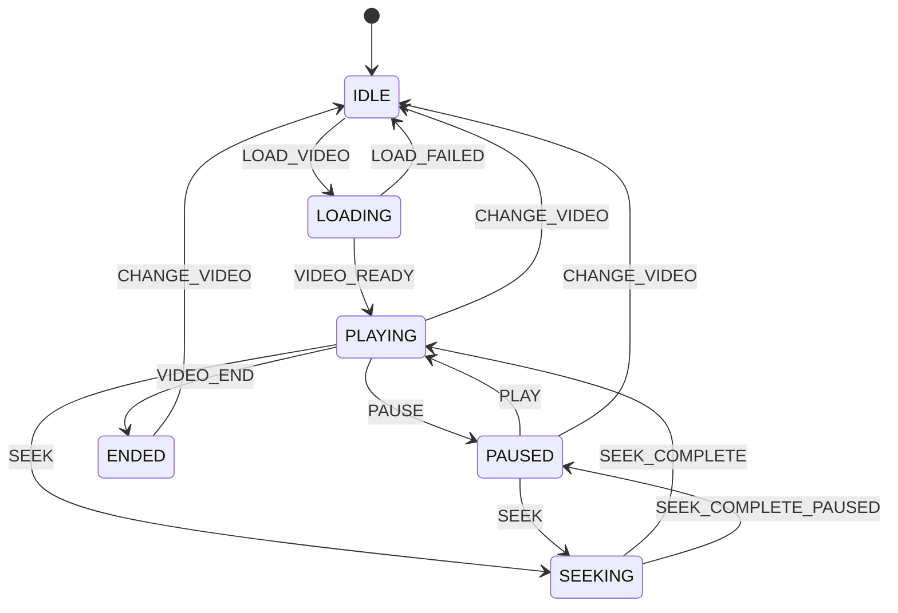
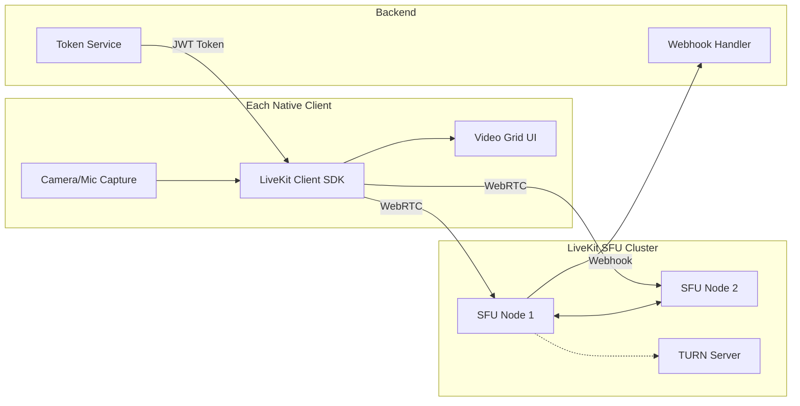
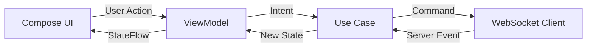
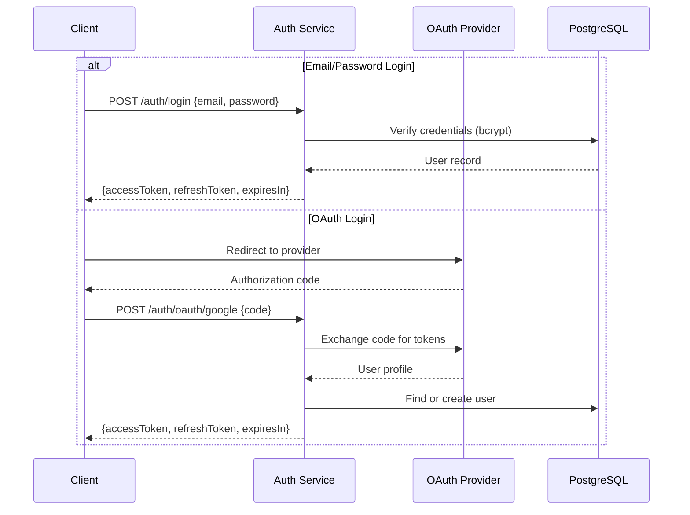
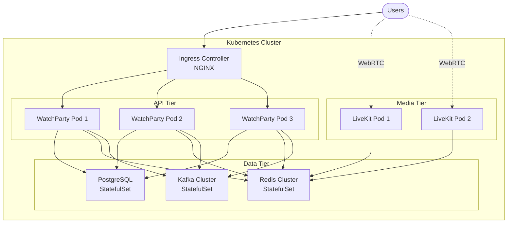
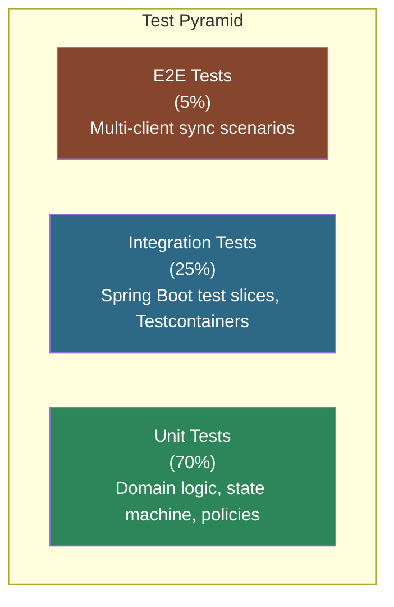
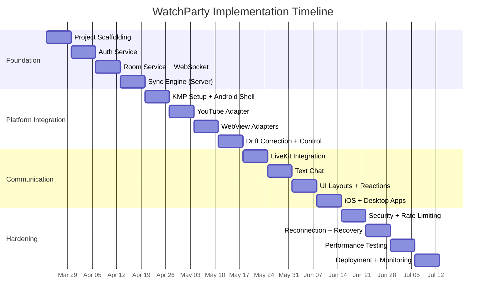

# WatchParty - Architecture and Implementation Guide

A production-grade, cross-platform watch party application enabling synchronized video playback across YouTube, Netflix, Hotstar, and Amazon Prime Video with real-time audio, video, and text chat capabilities. Built on a Java backend with native clients, following SOLID principles, immutable data patterns, and carefully selected design patterns.

---

## Summary

This document provides a complete technical blueprint for building "WatchParty" - a native application that synchronizes video playback across streaming platforms while providing Google Meet/Teams-style communication features. The architecture employs a `Spring Boot 3.x` backend with WebSocket/STOMP signaling, `LiveKit` as the `WebRTC` media server for audio/video chat, and `Kotlin Multiplatform (KMP)` for native cross-platform clients (Android, iOS, Desktop). The synchronization engine uses a server-authoritative state machine model with adaptive clock-drift correction, targeting sub-200ms sync accuracy across all participants. The system is designed for fault tolerance via event sourcing of room state, horizontal scalability through stateless service layers with `Redis-backed` session management, and high performance through non-blocking I/O with `Spring WebFlux` where applicable. All code follows `SOLID principles`, immutable value objects (via `Lombok`'s `@Value` and `@Builder`), and the Builder pattern to minimize boilerplate.

---

## Table of Contents

1. [Product Requirements](#product-requirements)
2. [System Architecture Overview](#system-architecture-overview)
3. [Technology Stack](#technology-stack)
4. [Core Domain Model](#core-domain-model)
5. [Synchronization Engine](#synchronization-engine)
6. [Platform Integration Layer](#platform-integration-layer)
7. [Real-Time Communication (Audio/Video/Text)](#real-time-communication)
8. [Backend Service Architecture](#backend-service-architecture)
9. [Client Architecture (KMP)](#client-architecture-kmp)
10. [API Design](#api-design)
11. [Security Architecture](#security-architecture)
12. [Database Design](#database-design)
13. [Deployment and Infrastructure](#deployment-and-infrastructure)
14. [Design Patterns Catalog](#design-patterns-catalog)
15. [Coding Standards and Conventions](#coding-standards-and-conventions)
16. [Testing Strategy](#testing-strategy)
17. [Implementation Roadmap](#implementation-roadmap)
18. [Failure Modes and Resilience](#failure-modes-and-resilience)
19. [Performance Targets and Optimization](#performance-targets-and-optimization)
20. [References](#references)

---

## Product Requirements

### Functional Requirements

:::columns-2
:::section {border}
**Core Watch Party Features**

- Host creates a room and shares an invite link/code
- Participants join a room (up to 20 concurrent viewers per room initially)
- Host selects a video from supported platforms: YouTube, Netflix, Hotstar, Amazon Prime Video
- Playback controls: play, pause, seek/skip - synchronized across all participants
- Host can grant/revoke playback control to other participants (control delegation)
- Participant list with online/offline status and who currently holds control
- Reactions overlay (emoji reactions during playback)
:::
+++
:::section {border}
**Communication Features (Meet/Teams-style)**

- Real-time video chat (camera feeds shown in a grid/sidebar alongside the main video)
- Real-time audio chat with mute/unmute per participant
- Text chat panel with message history for the session
- Screen layout modes: theater mode (video dominant), gallery mode (chat dominant), picture-in-picture
- Raise hand, emoji reactions in chat
- Host moderation: mute participants, remove from room, lock room
:::
:::

### Non-Functional Requirements
:::table {width:100%}
| Requirement          | Target                                                    |
|:---------------------|:----------------------------------------------------------|
| Sync Accuracy        | Less than 200ms drift between any two participants        |
| Chat Latency         | Less than 100ms for text messages (p99)                   |
| Audio/Video Latency  | Less than 300ms end-to-end (WebRTC standard)              |
| Room Capacity        | 20 participants per room (v1), 100 (v2)                   |
| Supported Platforms  | Android, iOS, macOS, Windows, Linux (Desktop)             |
| Availability         | 99.9% uptime for backend services                         |
| Cold Start           | Room creation to first sync under 3 seconds               |
| Reconnection         | Auto-reconnect with state recovery within 5 seconds       |
:::


## System Architecture Overview



### Architecture Principles

The system follows a layered, hexagonal (ports and adapters) architecture where each bounded context is isolated behind well-defined interfaces. The core domain logic has zero dependency on infrastructure; all external integrations (databases, message brokers, media servers) are injected through port interfaces. This enables testability, swappability, and adherence to the Dependency Inversion Principle.

Key architectural decisions:
:::section {border bg}
**Server-Authoritative Sync.** The backend is the single source of truth for playback state. Clients send control intents (play, pause, seek) to the server; the server validates, applies, and broadcasts the canonical state. This prevents split-brain scenarios and drift accumulation that plague peer-to-peer sync approaches.

**LiveKit for Media.** Rather than building a custom WebRTC SFU, the architecture uses LiveKit - an open-source, battle-tested Selective Forwarding Unit with a native Kotlin/Java Server SDK. LiveKit handles all audio/video routing, encoding negotiation, and bandwidth adaptation. The Spring Boot backend generates LiveKit access tokens (JWT) and manages room lifecycle through LiveKit's server API.

**Event-Driven Internal Communication.** Services communicate through Kafka for durable, ordered event streams (room events, chat history, analytics) and Redis Pub/Sub for ephemeral, low-latency signaling (sync ticks, presence updates). This separation ensures that transient sync messages do not burden the persistent event log.
:::
---

## Technology Stack

:::table {width:100%}
| Layer [w=150]         | Technology [w=250]                        | Rationale                                                                  |
|:----------------------|:------------------------------------------|:---------------------------------------------------------------------------|
| Backend Framework     | Spring Boot 3.3.x (Java 21)              | Mature WebSocket/STOMP support, virtual threads (Project Loom), ecosystem  |
| Build Tool            | Gradle (Kotlin DSL)                       | Faster builds, better dependency management than Maven for multi-module    |
| WebSocket/Signaling   | Spring WebSocket + STOMP                  | Native integration, broker relay to RabbitMQ/Redis for horizontal scaling  |
| Media Server (RTC)    | LiveKit (self-hosted or Cloud)            | Open-source SFU, Kotlin/Java Server SDK, handles audio/video/data channels|
| Client Framework      | Kotlin Multiplatform + Compose Multiplatform | Shared business logic, native UI, JVM interop with backend SDK models    |
| Database              | PostgreSQL 16                             | ACID compliance for user/room data, JSONB for flexible metadata           |
| Cache / Session       | Redis 7.x (Cluster mode)                 | Sub-ms latency for sync state, pub/sub for cross-node broadcasting        |
| Event Bus             | Apache Kafka                              | Durable event sourcing for chat history, analytics, audit trails          |
| Auth                  | Spring Security + JWT + OAuth 2.0         | Stateless auth, social login (Google, Apple), token refresh               |
| API Documentation     | SpringDoc OpenAPI 3                       | Auto-generated API docs from annotations                                  |
| Containerization      | Docker + Docker Compose (dev)             | Reproducible environments, easy local development                        |
| Orchestration         | Kubernetes (production)                   | Horizontal scaling, health checks, rolling deployments                   |
| Monitoring            | Micrometer + Prometheus + Grafana         | Metrics, alerting, dashboards                                            |
| Logging               | SLF4J + Logback + ELK Stack              | Structured logging, centralized search                                   |
| CI/CD                 | GitHub Actions                            | Automated build, test, deploy pipelines                                  |
:::

---

## Core Domain Model

The domain model uses immutable value objects throughout. All entities are modeled as `@Value` (Lombok) classes with `@Builder` for construction. State transitions produce new instances rather than mutating existing ones.

### Entity Relationship Diagram



### Immutable Value Objects (Lombok)

All domain objects follow this pattern:

```java
@Value
@Builder(toBuilder = true)
public class PlaybackState {
    @NonNull UUID roomId;
    @NonNull Platform platform;
    @NonNull String videoUrl;
    double positionSeconds;
    boolean isPlaying;
    double playbackRate;
    long serverTimestampMs;
    int version;

    public PlaybackState withPosition(double newPosition, long timestamp) {
        return this.toBuilder()
            .positionSeconds(newPosition)
            .serverTimestampMs(timestamp)
            .version(this.version + 1)
            .build();
    }

    public PlaybackState withPlayingState(boolean playing, long timestamp) {
        return this.toBuilder()
            .isPlaying(playing)
            .serverTimestampMs(timestamp)
            .version(this.version + 1)
            .build();
    }
}
```

Key conventions:

- `@Value` makes all fields `private final` and generates getters, `equals`, `hashCode`, `toString` automatically
- `@Builder(toBuilder = true)` enables the Builder pattern for construction and the copy-with-modification pattern via `toBuilder()`
- State transitions always produce a new instance with an incremented `version` field
- `@NonNull` on required fields enforces null-safety at construction time
- No setters exist anywhere in the domain model

### Enumerations

```java
public enum Platform { YOUTUBE, NETFLIX, HOTSTAR, AMAZON_PRIME }
public enum RoomStatus { CREATED, ACTIVE, PAUSED, ENDED, EXPIRED }
public enum MemberRole { HOST, CO_HOST, PARTICIPANT, VIEWER }
public enum MessageType { TEXT, SYSTEM, REACTION, CONTROL_EVENT }
public enum ControlAction { PLAY, PAUSE, SEEK, CHANGE_VIDEO, CHANGE_RATE }
```

---

## Synchronization Engine

The synchronization engine is the heart of the application. It uses a server-authoritative state machine with adaptive correction to keep all participants within 200ms of each other.

### Sync Protocol Flow



### State Machine Design

The `PlaybackStateMachine` is a pure function that takes the current state and an action, and returns a new state. It has no side effects and is trivially testable.

```
States: IDLE -> LOADING -> PLAYING -> PAUSED -> SEEKING -> ENDED
```



### Clock Drift Correction Algorithm

Each client maintains a local estimate of the server's clock offset. The algorithm:

1. **NTP-style ping.** On connection and every 30 seconds, the client sends a timestamped ping. The server responds with the server timestamp plus the original client timestamp. The client computes: `offset = (serverTs - clientSendTs + serverTs - clientReceiveTs) / 2`
2. **Exponential moving average.** The offset is smoothed: `smoothedOffset = 0.8 * smoothedOffset + 0.2 * newOffset`
3. **Position calculation.** When a sync message arrives, the client calculates where the video *should* be: `expectedPosition = state.positionSeconds + (localNow - state.serverTimestampMs + smoothedOffset) / 1000.0 * state.playbackRate`
4. **Correction strategy.**
   - Drift under 50ms: no correction (imperceptible)
   - Drift 50ms to 500ms: adjust playback rate by +/-5% until converged (gradual, no visible jump)
   - Drift over 500ms: hard seek to expected position (visible but necessary)

### Heartbeat and Liveness

The server broadcasts a lightweight sync heartbeat every 2 seconds to all room participants. This heartbeat contains only `{positionSeconds, isPlaying, serverTimestampMs, version}` - approximately 64 bytes per message. Clients use this to detect and correct drift even when no explicit control actions occur.

If a client misses 3 consecutive heartbeats (6 seconds), the server marks them as `disconnected` and notifies other participants. On reconnect, the client requests the full current state and hard-seeks to the correct position.

---

## Platform Integration Layer

Each streaming platform requires a different integration strategy. The client embeds a platform-specific player and intercepts/injects playback commands through the player's API.

:::table {width:100%}
| Platform [w=150]    | Integration Method [w=200]       | Player API                            | Control Mechanism                                                        |
|:--------------------|:---------------------------------|:--------------------------------------|:-------------------------------------------------------------------------|
| YouTube             | YouTube IFrame/Android/iOS SDK   | `YT.Player` / native SDK              | Direct API: `player.seekTo()`, `player.playVideo()`, `player.pauseVideo()` |
| Netflix             | WebView with injected JS bridge  | No public API - DOM manipulation       | JavaScript injection via WebView bridge to intercept and control `&lt;video&gt;` element |
| Hotstar             | WebView with injected JS bridge  | No public API - DOM manipulation       | Same as Netflix - intercept HTML5 `&lt;video&gt;` element events               |
| Amazon Prime Video  | WebView with injected JS bridge  | No public API - DOM manipulation       | Same as Netflix - intercept HTML5 `&lt;video&gt;` element events               |
:::

### Platform Adapter Pattern (Strategy + Adapter)

Each platform is encapsulated behind a `PlatformPlayer` interface. The client uses the Strategy pattern to select the correct adapter at runtime based on the video URL.

```
interface PlatformPlayer {
    fun loadVideo(videoUrl: String)
    fun play()
    fun pause()
    fun seekTo(positionSeconds: Double)
    fun getCurrentPosition(): Double
    fun isPlaying(): Boolean
    fun setPlaybackRate(rate: Double)
    fun addListener(listener: PlaybackListener)
    fun release()
}
```

Concrete implementations:

- `YouTubePlayerAdapter` - wraps the official YouTube SDK, maps SDK callbacks to `PlaybackListener`
- `WebViewPlayerAdapter` - a generic adapter for Netflix, Hotstar, and Amazon Prime that:
  1. Loads the platform URL in an embedded WebView
  2. Injects a JavaScript bridge on page load that hooks into the HTML5 `&lt;video&gt;` element
  3. Exposes `play()`, `pause()`, `seekTo()` via `evaluateJavascript()` calls
  4. Receives playback events (timeupdate, play, pause, seeking) via a JS-to-native bridge callback

### WebView JS Bridge (Critical Implementation Detail)

For DRM-protected platforms (Netflix, Prime, Hotstar), the WebView must support Widevine L1 DRM. On Android this requires `WebView` with `MediaDrm` support; on iOS, `WKWebView` supports FairPlay Streaming. The JS bridge is injected after the page loads:

```javascript
// Injected into WebView after DOMContentLoaded
(function() {
    const video = document.querySelector('video');
    if (!video) return;

    // Expose control functions to native
    window.WatchPartyBridge = {
        play: () => video.play(),
        pause: () => video.pause(),
        seekTo: (t) => { video.currentTime = t; },
        getPosition: () => video.currentTime,
        isPlaying: () => !video.paused,
        setRate: (r) => { video.playbackRate = r; }
    };

    // Report events back to native
    ['play', 'pause', 'seeking', 'seeked', 'timeupdate', 'ended'].forEach(evt => {
        video.addEventListener(evt, () => {
            window.NativeBridge.postMessage(JSON.stringify({
                event: evt,
                position: video.currentTime,
                playing: !video.paused
            }));
        });
    });
})();
```

> **Important caveat:** Netflix and Amazon Prime actively detect and block automated control of their players in some contexts. The WebView approach works because the user is logged into their own account within the app's WebView, and the app is intercepting the local `&lt;video&gt;` element - not scraping or redistributing content. Each user streams from their own authenticated session. The legal and ToS implications should be reviewed with counsel before production deployment.

### Platform URL Detection

A `PlatformResolver` maps URLs to platforms:

```
youtube.com, youtu.be       -> YOUTUBE
netflix.com                 -> NETFLIX
hotstar.com, disney+hotstar -> HOTSTAR
primevideo.com, amazon.com  -> AMAZON_PRIME
```

This resolver follows the Chain of Responsibility pattern, with each platform handler checking if the URL matches its domain patterns.

---

## Real-Time Communication

The audio/video/text chat layer provides a Google Meet/Teams-style experience alongside the synchronized video playback.

### Audio/Video Architecture (LiveKit)



**Why LiveKit over building custom WebRTC:**

- LiveKit provides native Android (Kotlin), iOS (Swift), and multiplatform SDKs
- The server-side Kotlin SDK (available on Maven Central as `io.livekit:livekit-server:0.12.0`) integrates naturally with the Spring Boot backend
- LiveKit handles Selective Forwarding (SFU), simulcast, bandwidth estimation, codec negotiation, and TURN relay automatically
- The Spring Boot backend only needs to: generate access tokens, manage room lifecycle via LiveKit's REST API, and handle webhooks for participant events

**Token Generation (Spring Boot):**

The backend generates a LiveKit JWT token when a participant joins a room. This token encodes the participant's identity, room name, and permissions (can publish audio/video, can subscribe).

**Room Lifecycle:**

When a WatchParty room is created, the backend also creates a corresponding LiveKit room. When the WatchParty room ends, the backend closes the LiveKit room. Participant join/leave events in LiveKit are forwarded to the backend via webhooks.

### Text Chat Architecture

Text chat uses the existing WebSocket/STOMP connection (no separate transport needed).

```
Client -> STOMP SEND /app/room/{roomId}/chat -> ChatController -> ChatService -> Kafka (persistence) + Redis Pub/Sub (broadcast)
Redis Pub/Sub -> STOMP /topic/room/{roomId}/chat -> All subscribed clients
```

Chat messages are:

1. Validated (content length, rate limiting, profanity filter)
2. Published to Kafka for durable storage (chat history is replayable)
3. Published to Redis Pub/Sub for immediate fan-out to all room subscribers
4. The STOMP broker relay picks up the Redis Pub/Sub message and delivers to connected WebSocket clients

### UI Layout Modes

:::columns-2
:::section {border}
**Theater Mode (Default)**

The main video player occupies 75% of the screen. A sidebar shows participant video feeds in a vertical strip (small thumbnails). The chat panel slides in from the right edge. Controls overlay the bottom of the main video.
:::
+++
:::section {border}
**Gallery Mode**

All participant video feeds are shown in an equal grid (like Google Meet). The main video is reduced to a smaller inset or floating window. Chat occupies a full side panel. Useful during intermissions or discussion.
:::
:::

---

## Backend Service Architecture

### Module Structure (Gradle Multi-Module)

```
watchparty-backend/
    build.gradle.kts                  (root)
    settings.gradle.kts
    watchparty-domain/                (pure domain - no Spring dependency)
        src/main/java/
            com.watchparty.domain/
                model/                (PlaybackState, Room, User, etc.)
                event/                (DomainEvent classes)
                port/                 (interfaces: RoomRepository, SyncStateStore)
                service/              (PlaybackStateMachine, ControlPolicy)
    watchparty-application/           (use cases / application services)
        src/main/java/
            com.watchparty.application/
                usecase/              (CreateRoomUseCase, JoinRoomUseCase, etc.)
                dto/                  (request/response DTOs)
    watchparty-infrastructure/        (adapters - Spring, DB, Redis, Kafka)
        src/main/java/
            com.watchparty.infrastructure/
                config/               (WebSocketConfig, SecurityConfig, etc.)
                persistence/          (JPA repositories, Redis adapters)
                messaging/            (Kafka producers/consumers, STOMP controllers)
                media/                (LiveKit integration)
                web/                  (REST controllers)
    watchparty-launcher/              (Spring Boot main class, application.yml)
```

This structure enforces the hexagonal architecture at the build level. The `domain` module has zero external dependencies (no Spring, no JPA, no Redis). The `application` module depends only on `domain`. The `infrastructure` module implements the ports defined in `domain` and wires everything together with Spring.

### Key Services

:::table {width:100%}
| Service [w=180]           | Responsibility                                                              | Key Patterns                        |
|:--------------------------|:----------------------------------------------------------------------------|:------------------------------------|
| RoomService               | Create, join, leave, close rooms. Manage membership and settings.          | Command pattern, Builder             |
| SyncService               | Process control actions, maintain PlaybackStateMachine, broadcast state.    | State pattern, Observer              |
| ChatService               | Validate, store, and broadcast chat messages.                              | Chain of Responsibility (validation) |
| AuthService               | User registration, login, JWT issuance, OAuth integration.                 | Strategy (auth provider selection)   |
| MediaTokenService         | Generate LiveKit access tokens with appropriate grants.                    | Builder (token construction)         |
| NotificationService       | System notifications (user joined, control transferred, room ending).      | Observer, Event-driven               |
| ControlDelegationService  | Grant/revoke playback control, validate control permissions.               | Policy pattern                       |
:::

### STOMP Topic/Queue Layout

```
/topic/room/{roomId}/sync          -> Playback state broadcasts (all participants)
/topic/room/{roomId}/chat          -> Chat messages (all participants)
/topic/room/{roomId}/members       -> Membership changes (join, leave, role change)
/topic/room/{roomId}/control       -> Control delegation events
/queue/user/{userId}/notifications -> User-specific notifications (private queue)
/app/room/{roomId}/control         -> Client sends control actions (play, pause, seek)
/app/room/{roomId}/chat            -> Client sends chat messages
/app/ping                          -> Clock sync ping endpoint
```

---

## Client Architecture (KMP)

### Why Kotlin Multiplatform

The client uses Kotlin Multiplatform (KMP) with Compose Multiplatform for shared UI. This was chosen over Flutter for several critical reasons:

- **JVM interop.** The backend domain models (`PlaybackState`, `Room`, etc.) defined as Java classes can be directly shared with the Android client and used as-is in the KMP shared module via `expect`/`actual` declarations. No serialization boundary between backend and client domain.
- **Native WebRTC integration.** LiveKit provides native Kotlin/Swift SDKs. KMP's `expect`/`actual` mechanism allows wrapping these without bridges or plugins.
- **WebView DRM support.** Native `WebView` on Android and `WKWebView` on iOS support Widevine L1 and FairPlay respectively. Flutter's WebView plugin has historically had DRM gaps.
- **Market trajectory.** KMP adoption has grown from 7% to 23% in 18 months (2024-2025). Companies like Netflix, Cash App, and Forbes use KMP in production for shared business logic.

### KMP Module Structure

```
watchparty-client/
    shared/                           (KMP shared module)
        commonMain/
            domain/                   (shared domain models - mirrors backend)
            sync/                     (SyncEngine, ClockDriftCorrector)
            chat/                     (ChatRepository, ChatViewModel)
            room/                     (RoomRepository, RoomViewModel)
            network/                  (WebSocket client, REST client)
            platform/                 (PlatformPlayer interface)
        androidMain/
            platform/                 (YouTubePlayerAdapter, WebViewPlayerAdapter)
            media/                    (LiveKit Android SDK wrapper)
        iosMain/
            platform/                 (YouTubePlayerAdapter, WKWebViewPlayerAdapter)
            media/                    (LiveKit iOS SDK wrapper)
        desktopMain/
            platform/                 (CEF/JxBrowser WebViewPlayerAdapter)
            media/                    (LiveKit native SDK wrapper)
    androidApp/                       (Android-specific UI, Compose)
    iosApp/                           (iOS-specific UI, SwiftUI or Compose iOS)
    desktopApp/                       (Desktop UI, Compose Desktop)
```

### Client State Management

The client uses a unidirectional data flow (UDF) architecture. ViewModels hold `StateFlow` objects that the UI observes. All state mutations go through a `reduce` function.



### SyncEngine (Client-Side Core)

The `SyncEngine` runs on the shared KMP module and orchestrates:

1. Receiving sync broadcasts from the server
2. Calculating expected position using the clock drift corrector
3. Comparing expected vs. actual player position
4. Issuing correction commands to the `PlatformPlayer`
5. Throttling outbound control commands to prevent feedback loops (minimum 100ms between commands)

---

## API Design

### REST Endpoints

:::table {width:100%}
| Method [w=80] | Endpoint [w=300]                          | Description                                    | Auth       |
|:--------------|:------------------------------------------|:-----------------------------------------------|:-----------|
| POST          | `/api/v1/auth/register`                   | Register new user                              | None       |
| POST          | `/api/v1/auth/login`                      | Login, receive JWT                             | None       |
| POST          | `/api/v1/auth/refresh`                    | Refresh JWT token                              | JWT        |
| POST          | `/api/v1/auth/oauth/{provider}`           | OAuth login (Google, Apple)                    | None       |
| POST          | `/api/v1/rooms`                           | Create a new room                              | JWT        |
| GET           | `/api/v1/rooms/{roomId}`                  | Get room details                               | JWT        |
| POST          | `/api/v1/rooms/{roomId}/join`             | Join a room                                    | JWT        |
| POST          | `/api/v1/rooms/{roomId}/leave`            | Leave a room                                   | JWT        |
| DELETE        | `/api/v1/rooms/{roomId}`                  | Close/end a room (host only)                   | JWT + Host |
| POST          | `/api/v1/rooms/{roomId}/control/grant`    | Grant control to a participant                 | JWT + Host |
| POST          | `/api/v1/rooms/{roomId}/control/revoke`   | Revoke control from a participant              | JWT + Host |
| GET           | `/api/v1/rooms/{roomId}/members`          | List room members                              | JWT        |
| POST          | `/api/v1/rooms/{roomId}/media-token`      | Get LiveKit token for audio/video              | JWT        |
| GET           | `/api/v1/rooms/{roomId}/chat/history`     | Get paginated chat history                     | JWT        |
| PUT           | `/api/v1/rooms/{roomId}/settings`         | Update room settings (host only)               | JWT + Host |
:::

### WebSocket Message Schemas

**Control Action (Client to Server):**

```json
{
    "type": "CONTROL_ACTION",
    "action": "SEEK",
    "payload": {
        "positionSeconds": 142.5,
        "clientTimestampMs": 1711036800000
    }
}
```

**Sync Broadcast (Server to Client):**

```json
{
    "type": "SYNC_STATE",
    "state": {
        "platform": "YOUTUBE",
        "videoUrl": "https://youtube.com/watch?v=abc123",
        "positionSeconds": 142.5,
        "isPlaying": true,
        "playbackRate": 1.0,
        "serverTimestampMs": 1711036800050,
        "version": 47
    }
}
```

**Chat Message (Bidirectional):**

```json
{
    "type": "CHAT_MESSAGE",
    "messageId": "uuid",
    "senderId": "uuid",
    "senderName": "Alice",
    "content": "This scene is amazing!",
    "messageType": "TEXT",
    "sentAt": "2026-03-21T10:30:00Z"
}
```

---

## Security Architecture

### Authentication Flow



### Security Measures

:::table {width:100%}
| Concern                 | Mitigation                                                                         |
|:------------------------|:-----------------------------------------------------------------------------------|
| WebSocket Auth          | JWT validated on STOMP CONNECT frame via `ChannelInterceptor`                      |
| Room Access Control     | Room membership checked on every STOMP message via interceptor                     |
| Control Authorization   | `ControlPolicy` validates that the sender has active control grant before applying  |
| Rate Limiting           | Token bucket per user per endpoint (Redis-backed) - 10 control actions/sec max     |
| Chat Abuse              | Content length limits (500 chars), rate limit (2 msg/sec), optional profanity filter|
| DDoS Protection         | NGINX rate limiting at gateway, connection limits per IP                            |
| Data in Transit         | TLS 1.3 for all HTTP/WebSocket, DTLS for WebRTC media                              |
| Data at Rest            | AES-256 encryption for sensitive fields in PostgreSQL                               |
| LiveKit Token Scope     | Tokens scoped to specific room with minimal grants (publish, subscribe)             |
| Session Management      | JWT access tokens (15 min TTL), refresh tokens (7 day TTL, rotated on use)         |
:::

## Database Design

### PostgreSQL Schema

```sql
-- Users table
CREATE TABLE users (
    id          UUID PRIMARY KEY DEFAULT gen_random_uuid(),
    email       VARCHAR(255) UNIQUE NOT NULL,
    display_name VARCHAR(100) NOT NULL,
    password_hash VARCHAR(255),
    avatar_url  VARCHAR(500),
    auth_provider VARCHAR(50) DEFAULT 'LOCAL',
    created_at  TIMESTAMP WITH TIME ZONE DEFAULT NOW(),
    updated_at  TIMESTAMP WITH TIME ZONE DEFAULT NOW()
);

-- Rooms table
CREATE TABLE rooms (
    id          UUID PRIMARY KEY DEFAULT gen_random_uuid(),
    room_code   VARCHAR(10) UNIQUE NOT NULL,
    host_id     UUID NOT NULL REFERENCES users(id),
    status      VARCHAR(20) NOT NULL DEFAULT 'CREATED',
    created_at  TIMESTAMP WITH TIME ZONE DEFAULT NOW(),
    expires_at  TIMESTAMP WITH TIME ZONE,
    settings    JSONB DEFAULT '{}'::jsonb
);

-- Room memberships
CREATE TABLE room_memberships (
    id          UUID PRIMARY KEY DEFAULT gen_random_uuid(),
    room_id     UUID NOT NULL REFERENCES rooms(id) ON DELETE CASCADE,
    user_id     UUID NOT NULL REFERENCES users(id),
    role        VARCHAR(20) NOT NULL DEFAULT 'PARTICIPANT',
    is_connected BOOLEAN DEFAULT FALSE,
    joined_at   TIMESTAMP WITH TIME ZONE DEFAULT NOW(),
    UNIQUE(room_id, user_id)
);

-- Control grants
CREATE TABLE control_grants (
    id              UUID PRIMARY KEY DEFAULT gen_random_uuid(),
    room_id         UUID NOT NULL REFERENCES rooms(id) ON DELETE CASCADE,
    granted_to      UUID NOT NULL REFERENCES users(id),
    granted_by      UUID NOT NULL REFERENCES users(id),
    is_active       BOOLEAN DEFAULT TRUE,
    granted_at      TIMESTAMP WITH TIME ZONE DEFAULT NOW(),
    expires_at      TIMESTAMP WITH TIME ZONE
);

-- Chat messages (also in Kafka for replay, this is the queryable store)
CREATE TABLE chat_messages (
    id          UUID PRIMARY KEY DEFAULT gen_random_uuid(),
    room_id     UUID NOT NULL REFERENCES rooms(id) ON DELETE CASCADE,
    sender_id   UUID NOT NULL REFERENCES users(id),
    content     TEXT NOT NULL,
    message_type VARCHAR(20) DEFAULT 'TEXT',
    sent_at     TIMESTAMP WITH TIME ZONE DEFAULT NOW()
);

-- Indexes
CREATE INDEX idx_rooms_code ON rooms(room_code);
CREATE INDEX idx_rooms_host ON rooms(host_id);
CREATE INDEX idx_memberships_room ON room_memberships(room_id);
CREATE INDEX idx_memberships_user ON room_memberships(user_id);
CREATE INDEX idx_chat_room_time ON chat_messages(room_id, sent_at DESC);
CREATE INDEX idx_control_room_active ON control_grants(room_id) WHERE is_active = TRUE;
```

### Redis Key Structure

```
room:{roomId}:state              -> PlaybackState (JSON, TTL: room lifetime)
room:{roomId}:members            -> SET of userId (online members)
room:{roomId}:controller         -> userId (who currently has control)
user:{userId}:rooms              -> SET of roomId (rooms user is in)
ratelimit:control:{userId}       -> Token bucket counter (TTL: 1 sec)
ratelimit:chat:{userId}          -> Token bucket counter (TTL: 1 sec)
clock:offset:{sessionId}         -> Smoothed clock offset for session
```

---

## Deployment and Infrastructure

### Container Architecture



### Horizontal Scaling Strategy

The Spring Boot application is stateless. All session state lives in Redis, all persistent state lives in PostgreSQL, and all event streams live in Kafka. This allows scaling the API tier horizontally by adding pods.

**WebSocket sticky sessions** are required because a WebSocket connection is long-lived and stateful at the transport level. The NGINX ingress is configured with `sticky-cookie` based session affinity. If a pod dies, the client reconnects to any available pod, re-authenticates via JWT, re-subscribes to STOMP topics, and fetches the current state from Redis.

**LiveKit scaling** is handled by LiveKit's own clustering mechanism. Multiple LiveKit nodes coordinate via Redis and forward media streams between nodes as needed.

---

## Design Patterns Catalog

:::table {width:100%}
| Pattern [w=200]              | Where Used                            | Purpose                                                                     |
|:-----------------------------|:--------------------------------------|:----------------------------------------------------------------------------|
| Builder                      | All domain objects, DTOs, configs     | Lombok `@Builder` eliminates constructors with many parameters, enforces immutability |
| State Machine                | PlaybackStateMachine                  | Models playback lifecycle with well-defined transitions and guards          |
| Strategy                     | PlatformPlayer adapters               | Swappable platform-specific player implementations behind a common interface|
| Observer / Pub-Sub           | STOMP topics, Redis Pub/Sub, Kafka    | Decoupled event broadcasting to multiple subscribers                       |
| Chain of Responsibility      | Message validation, URL resolution    | Sequential processing where each handler decides to process or pass along  |
| Command                      | ControlAction processing              | Encapsulates control intents as objects for validation, logging, undo      |
| Adapter                      | LiveKit SDK wrapper, WebView bridge   | Converts third-party APIs to internal interfaces                           |
| Repository                   | Data access layer                     | Abstracts persistence behind domain-oriented interfaces                    |
| Factory Method               | PlatformPlayerFactory                 | Creates appropriate player adapter based on platform enum                  |
| Template Method              | Base WebSocket message handlers       | Common pre/post processing (auth, logging) with customizable core logic    |
| Singleton (Spring-managed)   | Services, Configs                     | Spring `@Service`, `@Configuration` beans are singletons by default        |
| Policy / Specification       | ControlPolicy, RoomPolicy             | Business rules as composable, testable objects                             |
| Event Sourcing               | Room event log (Kafka)                | Complete audit trail, replayable state reconstruction                      |
:::

---

## Coding Standards and Conventions

### SOLID Principles Application

**Single Responsibility:** Each service class handles exactly one bounded context. `SyncService` only manages playback state; it does not handle chat, auth, or room lifecycle.

**Open/Closed:** New platform support (e.g., adding Disney+ Hotstar) requires only creating a new `PlatformPlayer` implementation and registering it in `PlatformPlayerFactory`. No existing code is modified.

**Liskov Substitution:** All `PlatformPlayer` implementations are fully substitutable. The `SyncEngine` works identically regardless of which concrete adapter is active.

**Interface Segregation:** The `PlatformPlayer` interface contains only playback methods. Camera/microphone access is a separate `MediaDevice` interface. Room management is a separate `RoomPort` interface.

**Dependency Inversion:** The domain module defines `SyncStateStore` (interface). The infrastructure module provides `RedisSyncStateStore` (implementation). The domain never imports Redis.

### Immutability Rules

- All domain model classes use Lombok `@Value` (immutable by default)
- DTOs use Lombok `@Value` or Java 21 `record` types
- Collections returned from repositories are wrapped in `Collections.unmodifiableList()` or use Guava `ImmutableList`
- State transitions always create new objects via `toBuilder()...build()`
- No `void` methods that mutate internal state on domain objects

### Lombok Usage

```java
// Domain model
@Value @Builder(toBuilder = true)       // Immutable with copy builder
public class Room { ... }

// DTO (request)
@Value @Builder                          // Immutable, no copy needed
public class CreateRoomRequest { ... }

// DTO (response)
@Value @Builder                          // Immutable
public class RoomResponse { ... }

// Service layer
@Service
@RequiredArgsConstructor                 // Constructor injection, no @Autowired
@Slf4j                                  // Logger
public class RoomService { ... }

// Entity (JPA - needs mutability for JPA lifecycle)
@Entity @Table(name = "rooms")
@Getter @NoArgsConstructor(access = PROTECTED)  // JPA needs no-arg
@Builder @AllArgsConstructor                     // Builder for creation
public class RoomEntity { ... }
```

### Null Safety

- `@NonNull` on all required fields in builders
- `Optional<T>` for truly optional return values from repositories
- Never return `null` from any public method - use `Optional`, empty collections, or throw specific exceptions
- Use `Objects.requireNonNull()` in any non-Lombok constructor

### Package Conventions

- `model/` - domain objects (immutable value objects)
- `port/` - interfaces defined by the domain (inbound and outbound)
- `service/` - domain services (pure logic, no infrastructure)
- `usecase/` - application-level orchestration
- `adapter/` - infrastructure implementations of ports
- `config/` - Spring configuration classes
- `web/` - REST controllers
- `messaging/` - WebSocket/STOMP controllers, Kafka consumers/producers

---

## Testing Strategy

### Test Pyramid



### Unit Tests (70%)

The domain module is pure Java with no framework dependencies, making unit tests trivial:

- `PlaybackStateMachineTest` - every state transition, invalid transitions, boundary conditions
- `ClockDriftCorrectorTest` - drift calculation with simulated clock offsets
- `ControlPolicyTest` - permission checks for all role combinations
- `PlatformResolverTest` - URL pattern matching for all supported platforms

### Integration Tests (25%)

Using Spring Boot test slices and Testcontainers:

- `@WebMvcTest` for REST controller tests (mock services)
- `@DataJpaTest` with Testcontainers PostgreSQL for repository tests
- Custom test harness for WebSocket/STOMP integration tests using `StompSession`
- Redis integration tests using Testcontainers Redis

### End-to-End Tests (5%)

- Multi-client sync accuracy test: spawn 5 simulated clients, trigger play/pause/seek, verify all clients converge within 200ms
- Reconnection test: disconnect a client, verify it recovers state within 5 seconds
- Control delegation test: grant control, verify new controller can issue commands, old controller cannot

---

## Implementation Roadmap

### Phase 1 - Foundation (Weeks 1-4)
:::table {width:100%}
| Week | Deliverable                                                                |
|:-----|:---------------------------------------------------------------------------|
| 1    | Project scaffolding: Gradle multi-module, domain model, CI pipeline        |
| 2    | Auth service (JWT + OAuth), user registration/login, PostgreSQL setup      |
| 3    | Room service (CRUD), WebSocket/STOMP config, basic message routing         |
| 4    | SyncService + PlaybackStateMachine, Redis state store, sync heartbeat      |
:::

### Phase 2 - Platform Integration (Weeks 5-8)
:::table {width:100%}
| Week | Deliverable                                                                |
|:-----|:---------------------------------------------------------------------------|
| 5    | KMP project setup, shared domain module, Android app skeleton              |
| 6    | YouTube player adapter (Android), SyncEngine client-side                   |
| 7    | WebView player adapter for Netflix/Prime/Hotstar (Android)                 |
| 8    | Clock drift correction, adaptive sync, control delegation                  |
:::

### Phase 3 - Communication (Weeks 9-12)
:::table {width:100%}
| Week | Deliverable                                                                |
|:-----|:---------------------------------------------------------------------------|
| 9    | LiveKit integration, token generation, audio/video in Android app          |
| 10   | Text chat (STOMP + Kafka persistence), chat UI                             |
| 11   | UI layout modes (theater, gallery), participant list, reactions             |
| 12   | iOS app (shared logic + iOS-specific adapters), Desktop app skeleton       |
:::

### Phase 4 - Hardening (Weeks 13-16)
:::table {width:100%}
| Week | Deliverable                                                                |
|:-----|:---------------------------------------------------------------------------|
| 13   | Security hardening, rate limiting, input validation                        |
| 14   | Reconnection logic, fault recovery, offline detection                      |
| 15   | Performance testing, sync accuracy benchmarking, load testing              |
| 16   | Kubernetes deployment, monitoring (Prometheus/Grafana), logging (ELK)      |
:::

### Gantt Overview



---

## Failure Modes and Resilience

:::table {width:100%}
| Failure Scenario [w=220]       | Detection                                    | Recovery Strategy                                                              |
|:-------------------------------|:---------------------------------------------|:-------------------------------------------------------------------------------|
| Client WebSocket disconnect    | STOMP heartbeat timeout (6s)                 | Mark disconnected, auto-reconnect with exponential backoff, fetch state from Redis on reconnect |
| Server node crash              | Kubernetes health check (liveness probe)     | Pod restart, client reconnects to different pod, state recovered from Redis    |
| Redis unavailable              | Connection pool health check                 | Circuit breaker (Resilience4j), fallback to in-memory state for active rooms  |
| Kafka unavailable              | Producer callback errors                     | Chat messages buffered in-memory (bounded queue), retried when Kafka recovers |
| LiveKit SFU crash              | LiveKit webhook (participant disconnected)   | Clients auto-reconnect to available SFU node, LiveKit handles re-negotiation  |
| PostgreSQL unavailable         | HikariCP health check                        | Circuit breaker, read operations served from Redis cache, writes queued       |
| Clock drift exceeds 1 second   | Client-side drift monitor                    | Hard seek to correct position, log drift event for diagnostics                |
| Host leaves unexpectedly       | Membership change event                      | Auto-promote longest-tenured co-host or participant to host                   |
| Video platform blocks WebView  | WebView error callback / JS bridge failure   | Display error to user, suggest re-login to platform in WebView                |
:::

### Circuit Breaker Configuration

```yaml
resilience4j:
  circuitbreaker:
    instances:
      redisStateStore:
        slidingWindowSize: 10
        failureRateThreshold: 50
        waitDurationInOpenState: 10s
        permittedNumberOfCallsInHalfOpenState: 3
      postgresRepository:
        slidingWindowSize: 20
        failureRateThreshold: 50
        waitDurationInOpenState: 30s
```

---

## Performance Targets and Optimization

### Key Metrics

:::table {width:100%}
| Metric                         | Target       | Measurement Method                              |
|:-------------------------------|:-------------|:------------------------------------------------|
| Sync accuracy (p95)            | < 200ms      | Client-side drift logging, aggregated on server |
| WebSocket message latency (p99)| < 50ms       | Server-side STOMP interceptor timestamps        |
| REST API latency (p99)         | < 100ms      | Micrometer timer on controller methods          |
| Room join time                 | < 2s         | Client-side measurement from click to first sync|
| Memory per room (server)       | < 1MB        | JVM heap profiling per room object graph        |
| Concurrent rooms per node      | > 500        | Load test with simulated rooms                  |
| WebSocket connections per node | > 5000       | Gatling WebSocket load test                     |
:::

### Optimization Strategies

**Virtual Threads (Project Loom).** Spring Boot 3.3+ on Java 21 supports virtual threads. Enable them for all blocking I/O operations (Redis calls, PostgreSQL queries, LiveKit API calls). This eliminates the need for reactive programming (WebFlux) while still achieving high concurrency. Configuration: `spring.threads.virtual.enabled=true`.

**Binary WebSocket Frames.** For the sync heartbeat (sent every 2 seconds to every participant), use Protocol Buffers instead of JSON. A protobuf-encoded `SyncState` is approximately 32 bytes vs. 200+ bytes for JSON. At 500 rooms with 10 participants each, this saves approximately 1.6 MB/sec of bandwidth.

**Redis Pipelining.** When updating room state and broadcasting to pub/sub, pipeline both operations into a single round-trip. This halves the Redis latency for the critical sync path.

**Connection Pooling.** HikariCP for PostgreSQL (max 20 connections per pod), Lettuce for Redis (shared native connection with pipelining), Kafka producer with `linger.ms=5` for micro-batching.

---

## References

The following sources informed the architectural decisions and technology choices in this document.

### WebRTC and Media

1. **WebRTC Official**  
   https://webrtc.org/  
1. **LiveKit Documentation**  
   https://docs.livekit.io/intro/overview/
1. **LiveKit Kotlin/Java Server SDK (Maven Central)**  
   https://github.com/livekit/server-sdk-kotlin
1. **LiveKit Java Server Tutorial**  
   https://livekit-tutorials.openvidu.io/tutorials/application-server/java/
1. **WebRTC Tech Stack Guide (WebRTC.ventures, Jan 2026)**  
   https://webrtc.ventures/2026/01/webrtc-tech-stack-guide-architecture-for-scalable-real-time-applications/

### Spring Boot and WebSocket

1. **Baeldung - Guide to WebRTC with Spring Boot**  
   https://www.baeldung.com/webrtc
1. **Baeldung - Intro to WebSockets with Spring**  
   https://www.baeldung.com/websockets-spring
1. **Toptal - Spring Boot WebSocket with STOMP**  
   https://www.toptal.com/java/stomp-spring-boot-websocket
1. **OneUptime - WebSocket STOMP in Spring (Jan 2026)**  
   https://oneuptime.com/blog/post/2026-01-25-real-time-apps-websocket-stomp-spring/view

### Cross-Platform Development

1. **Kotlin Multiplatform vs Flutter (JetBrains Official)**  
    https://kotlinlang.org/docs/multiplatform/kotlin-multiplatform-flutter.html
1. **Java Code Geeks - KMP vs Flutter vs React Native: 2026 Reality (Feb 2026)**  
    https://www.javacodegeeks.com/2026/02/kotlin-multiplatform-vs-flutter-vs-react-native-the-2026-cross-platform-reality.html
1. **Bolder Apps - Top Cross-Platform Frameworks 2026 (Mar 2026)**  
    https://www.bolderapps.com/blog-posts/top-cross-platform-app-development-frameworks-in-2026

### Watch Party Architecture

1. **WatchParty Open Source (GitHub)**  
    https://github.com/howardchung/watchparty
1. **DEV Community - Watch Party Apps: Developer Perspective (Feb 2026)**  
    https://dev.to/roan_degraaf_9434e8e98ca/best-free-watch-party-apps-in-2026-a-developers-perspective-4f6
1. **ToTheNew - Multi-Device Sync Watch Parties (Dec 2025)**  
    https://www.tothenew.com/blog/multi-device-sync-watch-parties/  

> All URLs were verified as accessible on March 21, 2026. Technology versions and adoption figures reflect the state of the ecosystem as of this date.

---

> **Disclaimer:** This document represents a technical architecture plan based on publicly available information, documentation, and the author's engineering judgment. Technology choices, performance claims, and market data should be independently verified before committing to implementation. The integration approaches for DRM-protected streaming platforms (Netflix, Amazon Prime Video, Hotstar) operate in a legally complex space - consult legal counsel regarding Terms of Service compliance before production deployment. No guarantee is made regarding the accuracy of third-party tool capabilities, pricing, or licensing terms.
